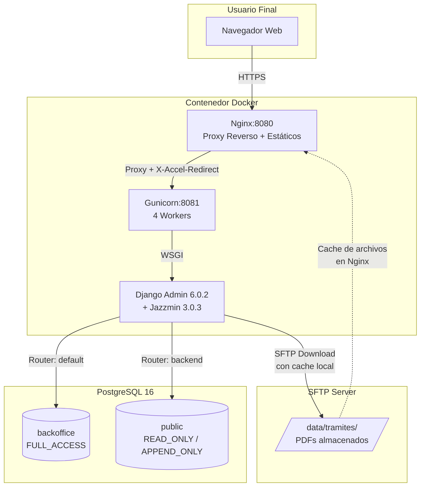
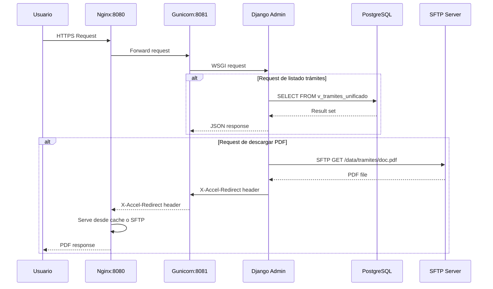
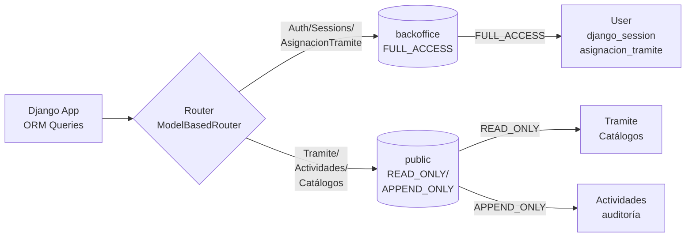
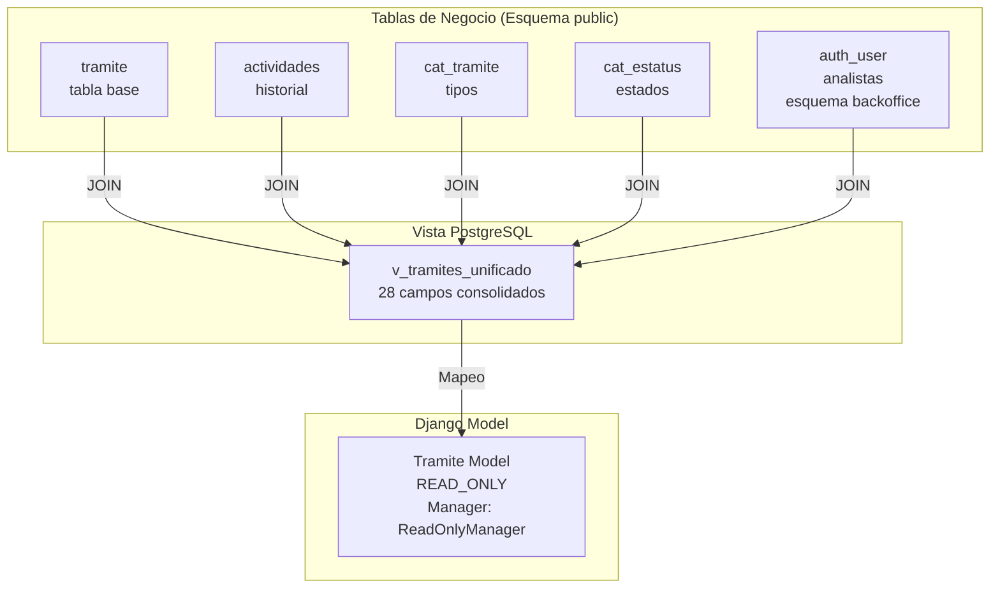
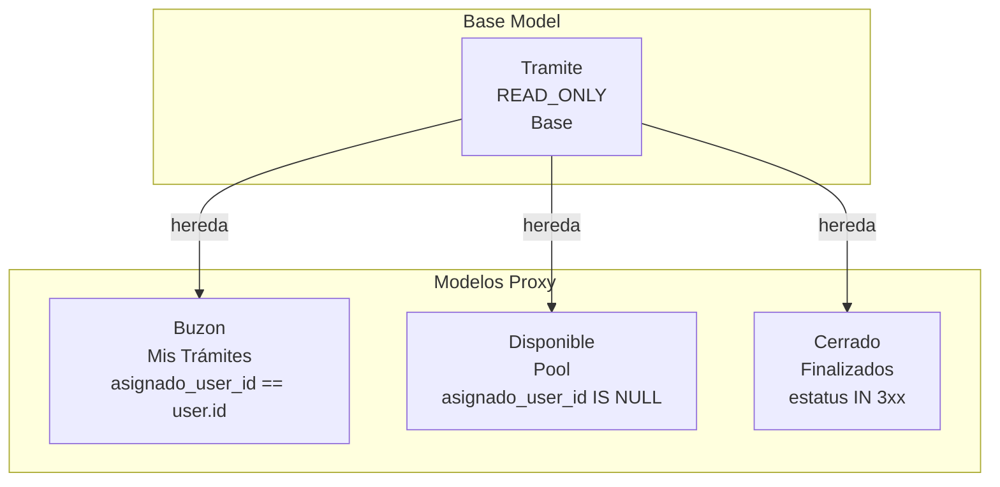
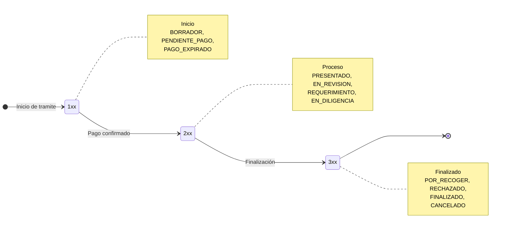

# Arquitectura del Sistema

**Autores:** Noe Nieto, Jose Ramon Bogarin, Carlos Ahizotl
**Estatus:** Aprobado
**Fecha de actualización:** 4 Mayo 2026

## 1. Resumen Ejecutivo

El Backoffice de Trámites es una aplicación web basada en Django Admin desplegada en un **contenedor único**, que se conecta a una base de datos PostgreSQL con separación de esquemas y a un servidor SFTP para documentos PDF.

El sistema utiliza Django Admin con el tema Jazzmin como interfaz de usuario, implementando control de acceso basado en tres roles (Administrador, Coordinador, Analista), workflow de trámites con 11 estados, y auditoría completa de todas las acciones.

## 2. Visión General

### 2.1 Propósito

Permitir a los funcionarios del Gobierno de San Felipe gestionar el ciclo de vida completo de trámites municipales con:

- Control de acceso basado en roles (RBAC)
- Trazabilidad completa de acciones
- Separación de datos legacy de datos de Django
- Cache agresivo para performance
- Fat models con lógica de negocio encapsulada

### 2.2 Principios de Diseño

- **Separación de esquemas:** Datos de Django vs datos de negocio (legacy)
- **Access Patterns:** Cada modelo tiene patrón de acceso explícito (READ_ONLY, FULL_ACCESS, APPEND_ONLY)
- **Cache agresivo:** Catálogos en memoria para minimizar queries
- **Fat Models:** Lógica de negocio encapsulada en modelos (permisos, workflow)
- **Single Container:** Arquitectura monolítica simplificada para despliegue

## 3. Arquitectura de Alto Nivel

### 3.1 Diagrama de Despliegue



**Descripción de componentes:**

| Componente | Tecnología | Propósito |
|------------|------------|-----------|
| **Nginx** | Nginx (distro) | Proxy reverso, serving de estáticos, X-Accel-Redirect para PDFs, cache de archivos descargados |
| **Gunicorn** | 25.1+ | Servidor WSGI con 4 workers para concurrencia |
| **Django Admin** | Django 6.0.2 + jazzmin 3.0.3 | Interfaz de usuario, ORM, auth, middleware |
| **PostgreSQL** | 16 | Base de datos relacional con 2 esquemas |
| **SFTP Server** | OpenSSH | Almacenamiento de PDFs de requisitos |

### 3.2 Flujo de Request



## 4. Capas del Sistema

### 4.1 Capa de Presentación (Django Admin)

**Descripción:** Interfaz web basada en Django Admin con tema Jazzmin (Bootstrap).

**Vistas de trámites:**

El sistema presenta **4 vistas de trámites** según el rol del usuario:

| Vista | Visible por | Descripción |
|-------|-------------|-------------|
| **Todos** | Administradores y Coordinadores | Todos los trámites activos (no filtrados) |
| **Buzón (Mis Trámites)** | Analistas | Solo trámites asignados al usuario actual (asignado_user_id == user.id) |
| **Disponibles** | Todos (Analistas + Coordinadores) | Trámites sin asignar en pool (asignado_user_id IS NULL) |
| **Cerrados** | Coordinadores y Administradores | Trámenes finalizados (estados 3xx) |

**Acciones rápidas:**
- Tomar trámite (analistas: autoasignar del pool)
- Liberar trámite (coordinadores: devolver al pool)
- Cambiar estatus (según workflow validado)
- Descargar documentos (vía SFTP con X-Accel-Redirect)

**Sidebar con permisos:**
El sidebar de Jazzmin presenta secciones según los permisos del usuario:
- ACCESO_ANALISTA → Ve "Buzón" y "Disponibles"
- ACCESO_COORDINADOR → Ve "En curso" (Todos) y "Cerrados"

---

### 4.2 Capa de Lógica de Negocio (Fat Models)

#### 4.2.1 Custom User Model

**Ubicación:** `core/models.py`

**Descripción:** Extensión de Django's AbstractUser con properties personalizadas para roles del sistema.

**Properties:**

```python
@property
def is_administrador(self) -> bool:
    """Retorna True si el usuario tiene rol de Administrador."""
    return BackOfficeRole.ADMINISTRADOR in self._get_roles()

@property
def is_coordinador(self) -> bool:
    """Retorna True si el usuario tiene rol de Coordinador."""
    return BackOfficeRole.COORDINADOR in self._get_roles()

@property
def is_analista(self) -> bool:
    """Retorna True si el usuario tiene rol de Analista."""
    return BackOfficeRole.ANALISTA in self._get_roles()
```

**Método clave:**

```python
def _get_roles(self) -> list[BackOfficeRole]:
    """
    Lee los roles del usuario.

    Prioridad:
    1. user.roles (middleware cache - request scope)
    2. Base de datos (Django groups)
    """
    roles = getattr(self, 'roles', None)
    if roles is None:
        return [BackOfficeRole(g.name) for g in self.groups.all()]
    return roles
```

**Almacenamiento de roles:**
Los roles se almacenan como grupos de Django en la tabla `auth_group`:
- `Administrador`
- `Coordinador`
- `Analista`

---

#### 4.2.2 Workflow Engine

**Ubicación:** `tramites/models/tramite.py`

**Descripción:** Diccionario que mapea transiciones válidas del workflow de trámites.

**Diccionario TRANSITIONS:**

```python
TRANSITIONS: dict[tuple[int, int], bool] = {
    # Assign: presentado → en_revision
    (TramiteEstatus.Estatus.PRESENTADO, TramiteEstatus.Estatus.EN_REVISION): True,

    # Reassign: en_revision → en_revision
    (TramiteEstatus.Estatus.EN_REVISION, TramiteEstatus.Estatus.EN_REVISION): True,

    # Release: en_revision → presentado
    (TramiteEstatus.Estatus.EN_REVISION, TramiteEstatus.Estatus.PRESENTADO): True,

    # Require documents: en_revision → requerimiento
    (TramiteEstatus.Estatus.EN_REVISION, TramiteEstatus.Estatus.REQUERIMIENTO): True,

    # En_diligencia: en_revision → en_diligencia
    (TramiteEstatus.Estatus.EN_REVISION, TramiteEstatus.Estatus.EN_DILIGENCIA): True,

    # Finalize from any active "in-process" state
    (TramiteEstatus.Estatus.EN_REVISION, TramiteEstatus.Estatus.FINALIZADO): True,
    (TramiteEstatus.Estatus.REQUERIMIENTO, TramiteEstatus.Estatus.FINALIZADO): True,
    (TramiteEstatus.Estatus.EN_DILIGENCIA, TramiteEstatus.Estatus.FINALIZADO): True,
}
```

**Validación:**

Método `_validate_transition(to_status)` en modelo `Tramite`:

```python
def _validate_transition(self, to_status: int) -> None:
    """
    Valida si la transición desde estatus actual hacia to_status es válida.

    Lanza:
        EstadoNoPermitidoError: Si la transición no está definida
    """
    current_status = self.estatus.id
    transition_key = (current_status, to_status)

    if transition_key not in TRANSITIONS:
        raise EstadoNoPermitidoError(
            f"Transición no permitida: {current_status} → {to_status}"
        )
```

---

#### 4.2.3 Permission Methods

**Ubicación:** `tramites/models/tramite.py`

**Descripción:** Métodos en modelo `Tramite` que determinan qué acciones puede realizar un usuario.

**Methods:**

| Método | Retorna | Lógica |
|--------|---------|--------|
| `can_view(user)` | `bool` | Admin/Coord: siempre. Analista: solo si asignado |
| `can_download(user)` | `bool` | Admin/Coord: siempre. Analista: asignados o disponibles activos |
| `can_assign(user)` | `bool` | Solo Coord/Admin |
| `can_release(user)` | `bool` | Solo Coord/Admin |
| `can_execute_action(user)` | `bool` | Admin/Coord: siempre. Analista: solo si asignado |
| `available_actions(user)` | `list[str]` | Lista de acciones según estatus actual y rol |

**Ejemplos:**

```python
# Verificar si usuario puede ver trámite
tramite.can_view(request.user)  # True/False

# Obtener acciones disponibles para usuario
acciones = tramite.available_actions(request.user)
# ['assign', 'release', 'change_status', 'download']

# Verificar si puede asignar
tramite.can_assign(request.user)  # Solo True para Coordinadores
```

---

### 4.3 Capa de Datos (PostgreSQL)

#### 4.3.1 Separación de Esquemas

**Descripción:** PostgreSQL con dos esquemas para separar datos Django de datos legacy.

**Diagrama de routing:**



**Esquemas:**

| Esquema | Propósito | Access Pattern | Modelos clave |
|---------|-----------|----------------|---------------|
| `backoffice` | Datos propios de Django | FULL_ACCESS | User, django_session, asignacion_tramite |
| `public` | Datos de negocio (legacy) | READ_ONLY / APPEND_ONLY | Tramite, Actividades, Catálogos |

**Router:** `core.db_router.ModelBasedRouter`

El router usa el decorador `@register_model()` para determinar a qué esquema routing la query.

**Para detalles completos:** Ver [ADR-008: PostgreSQL Schema Separation](../06-decisions/008-postgresql-schema-separation.md).

---

#### 4.3.2 Vista Denormalizada (v_tramites_unificado)

**Descripción:** Vista PostgreSQL que consolida datos de 5 tablas en una sola vista denormalizada para optimizar consultas.

**Diagrama de JOIN:**



**IMPORTANTE: CÓMO SE ACTUALIZA LA VISTA**

⚠️ **NO HAY TRIGGERS DE POSTGRESQL**

La vista `v_tramites_unificado` recalcula automáticamente **cada vez que se consulta**. Este es el comportamiento nativo de las vistas en PostgreSQL:

1. Usuario cambia estatus → Django crea registro en `actividades` (create-only)
2. La **siguiente consulta** a `v_tramites_unificado` recalcula el JOIN de las 5 tablas
3. El cambio ya está visible en la vista

**Ventaja:** No hay overhead de triggers, la vista siempre refleja el estado actual de las tablas.

**Desventaja:** Consultas repetidas al mismo trámite pueden recalcular el JOIN (mitigado con cache de Django).

**Para detalles completos:** Ver [ADR-009: Vista PostgreSQL Unificada](../06-decisions/009-vista-postgresql-para-tramites.md).

---

#### 4.3.3 Access Patterns y Custom Managers

**Descripción:** Sistema de patrones de acceso que enforce qué operaciones están permitidas en cada modelo.

**Enum AccessPattern** (`core.model_config`):

| Patrón | Permite | No permite | Usado por | Manager |
|--------|---------|-----------|-----------|---------|
| **FULL_ACCESS** | Create, Read, Update, Delete | - | User, asignacion_tramite, django_session | DefaultManager |
| **READ_ONLY** | Solo Read | Create, Update, Delete | Tramite, catálogos (todos) | ReadOnlyManager |
| **APPEND_ONLY** | Create + Read | Update, Delete | Actividades (auditoría) | CreateOnlyManager |

**Custom Managers:**

**ReadOnlyManager** (`core.managers.ReadOnlyManager`):

Previene TODAS las operaciones de escritura:
- `create()` → RuntimeError
- `update()` → RuntimeError
- `delete()` → RuntimeError

Útil para modelos inmutables (catálogos).

**CreateOnlyManager** (`core.managers.CreateOnlyManager`):

Permite `create()` y `bulk_create()`, pero previene:
- `update()` → RuntimeError
- `delete()` → RuntimeError

Útil para logs de auditoría (no se modifican).

**CachedReadOnlyManager** (`core.managers.CachedReadOnlyManager`):

Extiende ReadOnlyManager con cache en memoria:
- `all_cached()` - Cache key: `modelname:all`, TTL: 300 segundos
- `get_cached(id)` - Cache key: `modelname:pk:{id}`, TTL: 300 segundos

Útil para catálogos que casi no cambian.

**Decorador de registro:**

```python
@register_model('backend', AccessPattern.READ_ONLY, False)
class Tramite(models.Model):
    """
    'backend' → Schema: public
    AccessPattern.READ_ONLY → Solo lectura
    False → No generar migraciones para este modelo
    """
    objects = ReadOnlyManager()
```

---

#### 4.3.4 Modelos Proxy (Buzon, Disponible, Cerrado)

**Descripción:** 3 modelos proxy que extienden de `Tramite` proporcionando vistas filtradas según contexto y permisos.

**Relación de herencia:**



**Modelo Buzon:**

- Filtra por `asignado_user_id == request.user.id`
- Solo accesible para Analistas
- Muestra trámites en estados activos (2xx)

**Modelo Disponible:**

- Filtra por `asignado_user_id IS NULL`
- Accesible para Analistas y Coordinadores
- Solo trámites en estado PRESENTADO (201)

**Modelo Cerrado:**

- Filtra por estados finalizados (3xx)
- Accesible solo para Coordinadores y Administradores
- Permite monitoreo de trámites concluidos

**Para detalles completos:** Ver [03-MODELO-DE-DATOS.md](03-MODELO-DE-DATOS.md) (Sección 4.2 Modelos Proxy).

---

## 5. Sistema de Cache

### 5.1 Estrategia de Cache

El sistema usa **LocMemCache** (memoria por proceso) - no Redis:

| Nivel | Mecanismo | Uso | TTL | Ubicación |
|-------|-----------|-----|-----|----------|
| **Process** | `@lru_cache` | Catálogos que casi nunca cambian | ∞ (hasta reinicio) | Memoria Python |
| **Django Cache** | LocMemCache | Estadísticas de trámites, listados | 5 min | settings.CACHES |
| **Request** | `CacheUserRolesMiddleware` | Roles del usuario | Por request | `request.user.roles` |

### 5.2 Cache de Django

**Configuración en `settings.py`:**

```python
CACHES = {
    'default': {
        'BACKEND': 'django.core.cache.backends.locmem.LocMemCache',
        'LOCATION': 'backoffice-cache',
        'TIMEOUT': 300,  # 5 minutos
    }
}
```

**Uso:**

```python
from django.core.cache import cache

# Cache estadísticas de trámites
tramites_por_status = cache.get('tramites_por_status')
if not tramites_por_status:
    tramites_por_status = Tramite.objects.values('estatus').annotate(count=Count('id'))
    cache.set('tramites_por_status', tramites_por_status, 300)
```

**Para detalles completos:** Ver [ADR-003: Estrategia de Caching](../06-decisions/003-estrategia-caching-rendimiento.md).

---

## 6. Workflow de Trámites

### 6.1 Estados del Sistema



**Estados (con correcciones de acentos):**

| ID | Estado | Responsable | Descripción |
|-----|---------|-------------|-------------|
| **101** | BORRADOR | Ciudadano | El ciudadano está capturando información |
| **102** | PENDIENTE_PAGO | Ciudadano | El trámite está bloqueado esperando pago |
| **103** | PAGO_EXPIRADO | Sistema | La línea de captura venció |
| **201** | PRESENTADO | Sistema | Pago confirmado, trámite entra a bandeja |
| **202** | EN_REVISION | Funcionario | Analista revisando documentos |
| **203** | REQUERIMIENTO | Ciudadano | Falta información, ciudadano debe corregir |
| **205** | EN_DILIGENCIA | Perito | Fase de campo: mediciones, inspecciones |
| **301** | POR_RECOGER | Ciudadano | Documento disponible para descarga |
| **302** | RECHAZADO | Funcionario | Resolución negativa |
| **303** | FINALIZADO | Sistema | Ciudadano recibió documento |
| **304** | CANCELADO | Sistema | Trámite interrumpido |

**Para detalles completos:** Ver [05-reference/estados-tramites.md](../05-reference/estados-tramites.md).

---

## 7. Control de Acceso Basado en Roles (RBAC)

### 7.1 Tres Roles Definidos

**Ubicación:** `core/rbac/constants.py`

```python
class BackOfficeRole(StrEnum):
    ADMINISTRADOR = 'Administrador'
    COORDINADOR = 'Coordinador'
    ANALISTA = 'Analista'
```

### 7.2 Matriz de Permisos

| Acción | Administrador | Coordinador | Analista |
|---------|---------------|-------------|----------|
| Ver **todos** los trámites | ✅ | ✅ | ❌ |
| Ver **buzón** (mis trámites) | ✅ | ✅ | ✅ |
| Ver **disponibles** | ✅ | ✅ | ✅ |
| Ver **cerrados** (3xx) | ✅ | ✅ | ❌ |
| Asignar/reasignar | ✅ | ✅ | ❌ |
| Cambiar estatus | ✅ | ✅ | ✅ (solo asignados) |
| Descargar documentos | ✅ | ✅ | ✅ (solo asignados + disponibles) |
| Gestionar usuarios | ✅ | ❌ | ❌ |

### 7.3 Sidebar Permissions

**Ubicación:** `core/rbac/constants.py`

```python
class TramitePermission:
    ACCESO_ANALISTA = 'acceso_analista'      # Buzón + Disponibles
    ACCESO_COORDINADOR = 'acceso_coordinador'  # En curso + Cerrados

ROLE_CUSTOM_PERMISSIONS = {
    BackOfficeRole.ADMINISTRADOR: [ACCESO_ANALISTA, ACCESO_COORDINADOR],
    BackOfficeRole.COORDINADOR: [ACCESO_ANALISTA, ACCESO_COORDINADOR],
    BackOfficeRole.ANALISTA: [ACCESO_ANALISTA],
}
```

**Para detalles completos:** Ver [ADR-014: Custom User + Workflow Permissions](../06-decisions/014-custom-user-workflow-permissions.md).

---

## 8. Stack Tecnológico

| Componente | Tecnología | Versión |
|------------|------------|---------|
| **Lenguaje** | Python | 3.14 |
| **Framework** | Django | 6.0.2 |
| **Admin UI** | jazzmin | 3.0.3 |
| **Base de datos** | PostgreSQL | 16 |
| **Servidor WSGI** | Gunicorn | 25.1+ |
| **Proxy reverso** | Nginx | (distro) |
| **Contenedores** | Docker/Podman | - |
| **Package manager** | uv | latest |
| **Task runner** | just | - |
| **Linting** | ruff | - |
| **Type checking** | pyright | - |
| **Testing** | pytest + pytest-django | - |

**Para detalles completos:** Ver [ADR-012: Stack Base Actualizado](../06-decisions/012-stack-base-actualizado.md).

---

## 9. Apps Django

| App | Propósito |
|-----|-----------|
| `core` | Infraestructura: RBAC, middleware, db router, management commands, Custom User, managers |
| `tramites` | Modelos de negocio: Tramite, Buzon, Disponible, Cerrado, Actividades, Catálogos, Admin config |
| `jazzmin` | Tema Bootstrap para Django Admin |
| `django.contrib.auth` | Authentication system |
| `django.contrib.sessions` | Sessions management |
| `django.contrib.admin` | Django Admin |
| `django.contrib.messages` | Messages framework |
| `django.contrib.staticfiles` | Static files management |

---

## 10. Decisiones de Arquitectura Clave (Referencias a ADRs)

| # | Decisión | Estado |
|---|-----------|---------|
| [ADR-008](../06-decisions/008-postgresql-schema-separation.md) | PostgreSQL Schema Separation | **Current** |
| [ADR-009](../06-decisions/009-vista-postgresql-para-tramites.md) | Vista PostgreSQL Unificada | **Current** |
| [ADR-010](../06-decisions/010-integracion-con-sftp.md) | Integración SFTP | **Current** |
| [ADR-012](../06-decisions/012-stack-base-actualizado.md) | Stack Actualizado | **Current** |
| [ADR-014](../06-decisions/014-custom-user-workflow-permissions.md) | Custom User + Workflow Permissions | **Current** |

**IMPORTANTE:** Las ADRs son la Single Source of Truth (SSOT) para decisiones técnicas detalladas. Este documento de arquitectura proporciona una visión de alto nivel con referencias a los ADRs.

---

## 11. Convenciones de Terminología

### 11.1 Estados del Workflow (SIN Acentos)

**Correcciones aplicadas en todo el proyecto:**

| Incorrecto | Correcto (Aplicado) |
|------------|---------------------|
| `en_diligència` | `en_diligencia` ✅ |
| `es_actívo` | `es_activo` ✅ |

### 11.2 Campos de Modelo

| Campo | Incorrecto | Correcto (Aplicado) |
|-------|------------|---------------------|
| Observaciones | `observación` | `observacion` ✅ |

---

## 12. Referencias Externas

Para detalles completos sobre:

- **Separación de esquemas**: [ADR-008: PostgreSQL Schema Separation](../06-decisions/008-postgresql-schema-separation.md)
- **Vista v_tramites_unificado**: [ADR-009: Vista PostgreSQL Unificada](../06-decisions/009-vista-postgresql-para-tramites.md)
- **Integración SFTP**: [ADR-010: Integración con SFTP](../06-decisions/010-integracion-con-sftp.md)
- **Estrategia de caching**: [ADR-003: Estrategia de Caching](../06-decisions/003-estrategia-caching-rendimiento.md)
- **Custom User + Workflow Permissions**: [ADR-014: Custom User + Workflow Permissions](../06-decisions/014-custom-user-workflow-permissions.md)
- **Stack tecnológico**: [ADR-012: Stack Base Actualizado](../06-decisions/012-stack-base-actualizado.md)
- **Modelo de datos completo**: [03-MODELO-DE-DATOS.md](03-MODELO-DE-DATOS.md)
- **Requerimientos de negocio**: [00-REQUERIMIENTOS.md](00-REQUERIMIENTOS.md)
- **Historias de usuario**: [02-HISTORIAS-USUARIO.md](02-HISTORIAS-USUARIO.md)
