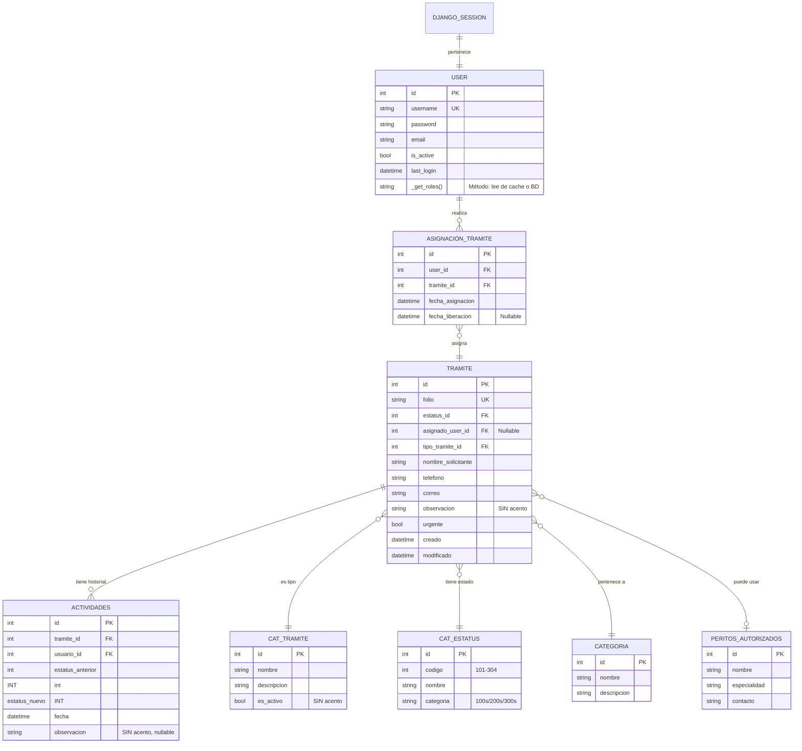

# Modelo de Datos

**Autores:** Noe Nieto, Jose Ramon Bogarin, Carlos Ahizotl
**Estatus:** Aprobado
**Fecha de actualización:** 28 Abril 2026

## 1. Visión General

El sistema utiliza PostgreSQL como base de datos relacional con **dos esquemas separados** para diferentes propósitos:

- **Esquema `backoffice`**: Datos propios de Django (usuarios, sesiones, asignaciones)
- **Esquema `public`**: Datos de negocio legacy (trámites, actividades, catálogos)

Esta separación permite mantener datos legacy sin afectar la estructura de Django, mientras se aprovechan las capacidades de PostgreSQL.

## 2. Diagrama ERD Completo



## 3. Esquema `backoffice`

El esquema `backoffice` contiene tablas propias de Django para autenticación, sesiones y asignaciones. Todas las tablas tienen patrón de acceso **FULL_ACCESS**.

### 3.1 Tabla: `auth_user` (Custom User Model)

**Descripción:** Extensión de Django's AbstractUser con propiedades personalizadas para roles del sistema.

**Campos base (heredados):**
- `id` (INT, PK)
- `username` (VARCHAR, UNIQUE)
- `password` (VARCHAR)
- `email` (VARCHAR)
- `is_active` (BOOLEAN)
- `is_staff` (BOOLEAN)
- `last_login` (DATETIME)
- `date_joined` (DATETIME)

**Propiedades personalizadas:**

```python
@property
def is_administrador(self) -> bool:
    """Retorna True si el usuario tiene rol de Administrador."""
    return BackOfficeRole.ADMINISTRADOR in self._get_roles()

@property
def is_coordinador(self) -> bool:
    """Retorna True si el usuario tiene rol de Coordinador."""
    return BackOfficeRole.COORDINADOR in self._get_roles()

@property
def is_analista(self) -> bool:
    """Retorna True si el usuario tiene rol de Analista."""
    return BackOfficeRole.ANALISTA in self._get_roles()
```

**Método clave:**

```python
def _get_roles(self) -> list[BackOfficeRole]:
    """
    Lee los roles del usuario.

    Prioridad:
    1. user.roles (middleware cache - request scope)
    2. Base de datos (Django groups)
    """
    roles = getattr(self, 'roles', None)
    if roles is None:
        # Fallback a grupos de Django
        return [BackOfficeRole(g.name) for g in self.groups.all()]
    return roles
```

**Access Pattern:** FULL_ACCESS
**Manager:** DefaultManager

### 3.2 Tabla: `django_session`

**Descripción:** Tabla estándar de Django para sesiones de usuario.

**Campos:**
- `session_key` (VARCHAR, PK)
- `session_data` (TEXT)
- `expire_date` (DATETIME)

**Access Pattern:** FULL_ACCESS
**Manager:** DefaultManager

### 3.3 Tabla: `asignacion_tramite`

**Descripción:** Tabla de relación many-to-many entre User y Tramite para rastrear asignaciones.

**Campos:**
- `id` (INT, PK, AUTO_INCREMENT)
- `user_id` (INT, FK → auth_user.id)
- `tramite_id` (INT, FK → tramite.id)
- `fecha_asignacion` (DATETIME, default=NOW)
- `fecha_liberacion` (DATETIME, nullable)

**Índices:**
- `idx_user_tramite` (user_id, tramite_id)
- `idx_fecha_asignacion` (fecha_asignacion)

**Access Pattern:** FULL_ACCESS
**Manager:** DefaultManager

**Restricciones:**
- Solo puede haber una asignación activa por trámite (user_id sin fecha_liberacion)
- Fecha de liberación no puede ser anterior a fecha de asignación

---

## 4. Esquema `public`

El esquema `public` contiene datos de negocio legacy (preexistentes). Los modelos Django mapean a tablas o vistas existentes.

### 4.1 Modelo: `Tramite` (Base Model)

**Descripción:** Modelo principal que representa un trámite municipal en su ciclo de vida completo.

**Campos principales:**

| Campo | Tipo | Descripción | Restricciones |
|-------|------|-------------|---------------|
| `id` | INT | Primary Key | AUTO_INCREMENT |
| `folio` | VARCHAR(50) | Folio único del trámite | UNIQUE, NOT NULL |
| `estatus` | INT FK | Estado actual del trámite | FK → cat_estatus.id |
| `asignado_user` | INT FK (nullable) | Usuario asignado | FK → auth_user.id |
| `tipo_tramite` | INT FK | Tipo de trámite | FK → cat_tramite.id |
| `nombre_solicitante` | VARCHAR(200) | Nombre del ciudadano | NOT NULL |
| `telefono` | VARCHAR(20) | Teléfono de contacto | nullable |
| `correo` | VARCHAR(200) | Correo electrónico | nullable |
| `observacion` | TEXT (nullable) | Observaciones adicionales | **SIN acento** |
| `urgente` | BOOLEAN | Marca de urgencia | Default=False |
| `creado` | DATETIME | Fecha de creación | Default=NOW |
| `modificado` | DATETIME | Última modificación | Auto-update |

**Campos calculados (from v_tramites_unificado):**
- `estatus_nombre` (VARCHAR) - Nombre del estado (ej: "EN_REVISION")
- `estatus_categoria` (VARCHAR) - Categoría "100s", "200s", "300s"
- `tipo_tramite_nombre` (VARCHAR) - Nombre del tipo de trámite
- `asignado_user_nombre` (VARCHAR) - Nombre completo del analista
- `asignado_user_username` (VARCHAR) - Username del analista
- `dias_en_estatus` (INT) - Días en estado actual
- `es_activo` (BOOLEAN) - **SIN acento** - True si estado es activo (2xx)

**Índices:**
- `idx_folio` (folio) - UNIQUE
- `idx_estatus` (estatus)
- `idx_asignado_user` (asignado_user)
- `idx_creado` (creado)
- `idx_urgente` (urgente)

**Access Pattern:** READ_ONLY
**Manager:** ReadOnlyManager

**Workflow Engine (Diccionario TRANSITIONS):**

```python
TRANSITIONS: dict[tuple[int, int], bool] = {
    # Assign: presentado → en_revision
    (TramiteEstatus.Estatus.PRESENTADO, TramiteEstatus.Estatus.EN_REVISION): True,

    # Reassign: en_revision → en_revision
    (TramiteEstatus.Estatus.EN_REVISION, TramiteEstatus.Estatus.EN_REVISION): True,

    # Release: en_revision → presentado
    (TramiteEstatus.Estatus.EN_REVISION, TramiteEstatus.Estatus.PRESENTADO): True,

    # Require documents: en_revision → requerimiento
    (TramiteEstatus.Estatus.EN_REVISION, TramiteEstatus.Estatus.REQUERIMIENTO): True,

    # En_diligencia: en_revision → en_diligencia
    (TramiteEstatus.Estatus.EN_REVISION, TramiteEstatus.Estatus.EN_DILIGENCIA): True,

    # Finalize from any active "in-process" state
    (TramiteEstatus.Estatus.EN_REVISION, TramiteEstatus.Estatus.FINALIZADO): True,
    (TramiteEstatus.Estatus.REQUERIMIENTO, TramiteEstatus.Estatus.FINALIZADO): True,
    (TramiteEstatus.Estatus.EN_DILIGENCIA, TramiteEstatus.Estatus.FINALIZADO): True,
}
```

**Validación:**
Método `_validate_transition(to_status)` verifica si `(from_status, to_status)` está en `TRANSITIONS`. Si no está presente, lanza `EstadoNoPermitidoError`.

---

### 4.2 Modelos Proxy

Los modelos proxy extienden de `Tramite` pero proporcionan vistas filtradas según el contexto y permisos del usuario.

#### 4.2.1 Modelo: `Buzon` (Mis Trámites)

**Descripción:** Modelo proxy para vista de trámites asignados al analista actual.

**Propósito:** Permitir a los analistas ver solo sus trámites asignados (buzón personal).

**Filtros automáticos en Admin:**
- `asignado_user_id == request.user.id` (solo trámites del usuario actual)
- `estatus IN [201, 202, 203, 205]` (solo estados activos de proceso)

**Access Control:**
- Solo accesible para usuarios con rol `ANALISTA`
- Admin/Coordinadores NO ven esta vista (usan vista "Todos")

**Meta:**
```python
class Meta:
    proxy = True
    verbose_name = 'Mis trámites'
    verbose_name_plural = 'Buzón de trámites'
    ordering = ('-creado', '-urgente')
```

**Access Pattern:** READ_ONLY (heredado de Tramite)
**Manager:** ReadOnlyManager (heredado de Tramite)

---

#### 4.2.2 Modelo: `Disponible` (Trámites Disponibles)

**Descripción:** Modelo proxy para vista de trámites disponibles en el pool para autoasignación.

**Propósito:** Permitir a analistas y coordinadores ver trámites sin asignar para autoasignación.

**Filtros automáticos en Admin:**
- `asignado_user_id IS NULL` (sin asignar)
- `estatus == 201` (solo estado PRESENTADO)

**Access Control:**
- Accesible para `ANALISTA` (autoasignar)
- Accesible para `COORDINADOR` (asignar a analista)
- `ADMINISTRADOR` puede ver pero no interactúa (usa vista "Todos")

**Meta:**
```python
class Meta:
    proxy = True
    verbose_name = 'Trámite disponible para autoasignación'
    verbose_name_plural = 'Trámites disponibles'
    ordering = ('-creado', '-urgente')
```

**Access Pattern:** READ_ONLY (heredado de Tramite)
**Manager:** ReadOnlyManager (heredado de Tramite)

---

#### 4.2.3 Modelo: `Cerrado` (Trámites Finalizados)

**Descripción:** Modelo proxy para vista de trámenes finalizados para el Coordinador.

**Propósito:** Permitir a coordinadores y administradores ver trámites en estados finalizados para análisis y reporting.

**Filtros automáticos en Admin:**
- `estatus IN [301, 302, 303, 304]` (estados finalizados 3xx)

**Access Control:**
- Solo accesible para `COORDINADOR` y `ADMINISTRADOR`
- `ANALISTA` NO ve esta vista

**Meta:**
```python
class Meta:
    proxy = True
    verbose_name = 'Trámites finalizados'
    verbose_name_plural = 'Trámites finalizados'
    ordering = ('-creado', '-urgente')
```

**Access Pattern:** READ_ONLY (heredado de Tramite)
**Manager:** ReadOnlyManager (heredado de Tramite)

---

### 4.3 Modelo: `Actividades` (Auditoría)

**Descripción:** Registro de todas las acciones realizadas sobre trámites. Fuente de verdad para el historial.

**Campos:**

| Campo | Tipo | Descripción | Restricciones |
|-------|------|-------------|---------------|
| `id` | INT | Primary Key | AUTO_INCREMENT |
| `tramite` | INT FK | Trámite afectado | FK → tramite.id |
| `usuario` | INT FK | Usuario que realizó acción | FK → auth_user.id |
| `estatus_anterior` | INT | Estado antes de la acción | nullable |
| `estatus_nuevo` | INT | Estado después de la acción | nullable |
| `fecha` | DATETIME | Timestamp de la acción | Default=NOW |
| `observacion` | TEXT | Observaciones de la acción | nullable, **SIN acento** |

**Índices:**
- `idx_tramite` (tramite)
- `idx_usuario` (usuario)
- `idx_fecha` (fecha)
- `idx_tramite_usuario` (tramite, usuario)

**Access Pattern:** APPEND_ONLY
**Manager:** CreateOnlyManager

**Restricciones CRÍTICAS:**
- NO se pueden modificar registros existentes (CreateOnlyManager bloquea `update()`)
- NO se pueden borrar registros (CreateOnlyManager bloquea `delete()`)
- Solo se puede crear nuevos registros vía `create()` o `bulk_create()`

**Ejemplo de uso:**
```python
# Crear registro de actividad (CORRECTO)
Actividades.objects.create(
    tramite_id=123,
    usuario_id=user.id,
    estatus_anterior=201,
    estatus_nuevo=202,
    observacion="Asignado a analista"
)

# Intentar modificar (INCORRECTO - lanza RuntimeError)
actividad = Actividades.objects.get(id=1)
actividad.observacion = "Nueva observacion"
actividad.save()  # RuntimeError: Cannot update CreateOnlyManager model

# Intentar borrar (INCORRECTO - lanza RuntimeError)
Actividades.objects.filter(id=1).delete()  # RuntimeError: Cannot delete CreateOnlyManager model
```

---

### 4.4 Catálogos (Todos READ_ONLY)

Todos los catálogos son modelos de referencia que se administran externamente. Son SOLO LECTURA desde el backoffice.

#### 4.4.1 Catálogo: `CatTramite` (Tipos de Trámites)

**Descripción:** Catálogo de tipos de trámites municipales disponibles.

**Campos:**
- `id` (INT, PK)
- `nombre` (VARCHAR(200)) - Nombre del tipo de trámite
- `descripcion` (TEXT, nullable) - Descripción detallada
- `es_activo` (BOOLEAN, default=True) - **SIN acento** - Marca de activo

**Access Pattern:** READ_ONLY
**Manager:** CachedReadOnlyManager (TTL 5 minutos)

---

#### 4.4.2 Catálogo: `CatEstatus` (Estados del Workflow)

**Descripción:** Catálogo de estados posibles del workflow de trámites.

**Campos:**
- `id` (INT, PK)
- `codigo` (INT) - Código de estado (101-304)
- `nombre` (VARCHAR(100)) - Nombre del estado
- `categoria` (VARCHAR(10)) - Categoría "100s", "200s", "300s"
- `descripcion` (TEXT, nullable) - Descripción del estado

**Estados registrados:**

| Código | Nombre | Categoría |
|--------|--------|-----------|
| 101 | BORRADOR | 100s |
| 102 | PENDIENTE_PAGO | 100s |
| 103 | PAGO_EXPIRADO | 100s |
| 201 | PRESENTADO | 200s |
| 202 | EN_REVISION | 200s |
| 203 | REQUERIMIENTO | 200s |
| 205 | EN_DILIGENCIA | 200s |
| 301 | POR_RECOGER | 300s |
| 302 | RECHAZADO | 300s |
| 303 | FINALIZADO | 300s |
| 304 | CANCELADO | 300s |

**Access Pattern:** READ_ONLY
**Manager:** CachedReadOnlyManager (TTL 5 minutos)

---

#### 4.4.3 Catálogo: `PeritosAutorizados` (Peritos)

**Descripción:** Catálogo de peritos autorizados para fase de campo.

**Campos:**
- `id` (INT, PK)
- `nombre` (VARCHAR(200)) - Nombre completo del perito
- `especialidad` (VARCHAR(200)) - Especialidad técnica
- `contacto` (VARCHAR(200), nullable) - Información de contacto
- `es_activo` (BOOLEAN, default=True) - **SIN acento** - Marca de activo

**Access Pattern:** READ_ONLY
**Manager:** CachedReadOnlyManager (TTL 5 minutos)

---

#### 4.4.4 Catálogo: `Categorias` (Categorías de Trámites)

**Descripción:** Catálogo de categorías organizativas de trámites.

**Campos:**
- `id` (INT, PK)
- `nombre` (VARCHAR(200)) - Nombre de la categoría
- `descripcion` (TEXT, nullable) - Descripción de la categoría
- `es_activo` (BOOLEAN, default=True) - **SIN acento** - Marca de activo

**Access Pattern:** READ_ONLY
**Manager:** CachedReadOnlyManager (TTL 5 minutos)

---

#### 4.4.5 Catálogo: `Requisitos` (Requisitos por Tipo)

**Descripción:** Catálogo de requisitos por tipo de trámite.

**Campos:**
- `id` (INT, PK)
- `tipo_tramite_id` (INT, FK) - Tipo de trámite
- `descripcion` (TEXT) - Descripción del requisito
- `obligatorio` (BOOLEAN) - Si es obligatorio
- `orden` (INT) - Orden de presentación

**Access Pattern:** READ_ONLY
**Manager:** ReadOnlyManager

---

## 5. Vista Denormalizada: `v_tramites_unificado`

**Descripción:** Vista PostgreSQL que consolida datos de 5 tablas en una sola vista denormalizada para optimizar consultas.

**Tablas fuente (JOIN):**
1. `tramite` (tabla base)
2. `actividades` (última actividad)
3. `cat_tramite` (nombre del tipo)
4. `cat_estatus` (nombre del estado)
5. `auth_user` (nombre del analista asignado)

**Campos consolidados (28):**

| Campo | Origen | Tipo | Descripción |
|-------|--------|------|-------------|
| `id` | tramite.id | INT | Primary Key |
| `folio` | tramite.folio | VARCHAR | Folio único |
| `estatus` | tramite.estatus_id | INT | ID de estado |
| `estatus_nombre` | cat_estatus.nombre | VARCHAR | Nombre del estado |
| `estatus_categoria` | cat_estatus.categoria | VARCHAR | "100s"/"200s"/"300s" |
| `asignado_user_id` | tramite.asignado_user_id | INT | ID del analista |
| `asignado_user_nombre` | auth_user.first_name + last_name | VARCHAR | Nombre del analista |
| `asignado_user_username` | auth_user.username | VARCHAR | Username del analista |
| `tipo_tramite_id` | tramite.tipo_tramite_id | INT | ID del tipo |
| `tipo_tramite_nombre` | cat_tramite.nombre | VARCHAR | Nombre del tipo |
| `nombre_solicitante` | tramite.nombre_solicitante | VARCHAR | Nombre del ciudadano |
| `telefono` | tramite.telefono | VARCHAR | Teléfono |
| `correo` | tramite.correo | VARCHAR | Correo |
| `observacion` | tramite.observacion | TEXT | Observaciones (**SIN acento**) |
| `urgente` | tramite.urgente | BOOLEAN | Marca de urgencia |
| `creado` | tramite.creado | DATETIME | Fecha de creación |
| `modificado` | tramite.modificado | DATETIME | Última modificación |
| `ultima_actividad_id` | actividades.id | INT | ID última actividad |
| `ultima_actividad_fecha` | actividades.fecha | DATETIME | Fecha última actividad |
| `ultima_actividad_usuario_id` | actividades.usuario_id | INT | ID usuario última acción |
| `ultima_actividad_estatus_anterior` | actividades.estatus_anterior | INT | Estado anterior |
| `ultima_actividad_estatus_nuevo` | actividades.estatus_nuevo | INT | Estado nuevo |
| `ultima_actividad_observacion` | actividades.observacion | TEXT | Observación (**SIN acento**) |
| `dias_en_estatus` | CALCULADO | INT | Días en estado actual |
| `es_activo` | CALCULADO | BOOLEAN | True si estado en 200s (**SIN acento**) |
| `total_actividades` | COUNT(actividades) | INT | Total de actividades |

**Mapeo a Django Model:**
- Mapeado a modelo `Tramite` en `tramites/models/tramite.py`
- **NO se puede modificar directamente** (READ_ONLY)
- Cambios se realizan vía tabla `actividades` (APPEND_ONLY)

**IMPORTANTE: CÓMO SE ACTUALIZA LA VISTA**

⚠️ **NO HAY TRIGGERS DE POSTGRESQL**

La vista `v_tramites_unificado` recalcula automáticamente **cada vez que se consulta**. Este es el comportamiento nativo de las vistas en PostgreSQL:

1. Usuario cambia estatus → Django crea registro en `actividades` (create-only)
2. La **siguiente consulta** a `v_tramites_unificado` recalcula el JOIN de las 5 tablas
3. El cambio ya está visible en la vista

**Ventaja:** No hay overhead de triggers, la vista siempre refleja el estado actual de las tablas.

**Desventaja:** Consultas repetidas al mismo trámite pueden recalcular el JOIN (mitigado con cache de Django).

**Nota:** Para detalles completos de la vista, ver [ADR-009: Vista PostgreSQL Unificada](../06-decisions/009-vista-postgresql-para-tramites.md).

---

## 6. Database Router (ModelBasedRouter)

**Descripción:** Sistema de routing de base de datos que dirige las queries al esquema correcto basándose en el modelo.

**Ubicación:** `core/db_router.py`

**Decorador de registro:**

```python
@register_model('backend', AccessPattern.READ_ONLY, False)
class Tramite(models.Model):
    """
    'backend' → Schema: public
    AccessPattern.READ_ONLY → Solo lectura
    False → No generar migraciones para este modelo
    """
    objects = ReadOnlyManager()
```

**Lógica del Router:**

```python
def db_for_read(self, model, **hints):
    """Determina qué esquema usar para consultas de lectura."""
    config = get_model_config_by_label(model._meta.label)
    if config and config.db_alias:
        return config.db_alias
    return 'default'

def db_for_write(self, model, **hints):
    """Determina qué esquema usar para escritura."""
    config = get_model_config_by_label(model._meta.label)
    if config and config.db_alias:
        return config.db_alias
    return 'default'

def allow_migrate(self, db, app_label, model_name=None, **hints):
    """Determina si generar migraciones para este modelo."""
    config = get_model_config_by_label(f"{app_label}.{model_name}")
    if config and not config.allow_migrations:
        return False
    return None
```

**Mapeo de DB Alias:**

| DB Alias | Schema | Propósito |
|----------|--------|-----------|
| `default` | `backoffice` | Datos Django (User, AsignacionTramite) |
| `backend` | `public` | Datos legacy (Tramite, Actividades, Catálogos) |

**Registro de modelos:**

```python
# Esquema backoffice (FULL_ACCESS)
@register_model('default', AccessPattern.FULL_ACCESS, True)
class User(AbstractUser): ...

@register_model('default', AccessPattern.FULL_ACCESS, True)
class AsignacionTramite(models.Model): ...

# Esquema public (READ_ONLY / APPEND_ONLY)
@register_model('backend', AccessPattern.READ_ONLY, False)
class Tramite(models.Model): ...

@register_model('backend', AccessPattern.APPEND_ONLY, False)
class Actividades(models.Model): ...

@register_model('backend', AccessPattern.READ_ONLY, False)
class CatTramite(models.Model): ...
```

---

## 7. Custom Managers

Los custom managers enforce los access patterns a nivel del ORM, previniendo operaciones no autorizadas.

### 7.1 ReadOnlyManager

**Descripción:** Previene TODAS las operaciones de escritura. Solo permite consultas de lectura.

**Ubicación:** `core/managers.py`

**Métodos bloqueados:**
- `create()` → RuntimeError
- `bulk_create()` → RuntimeError
- `update()` → RuntimeError
- `delete()` → RuntimeError
- `get_or_create()` → RuntimeError

**Métodos permitidos:**
- `all()`
- `filter()`
- `get()`
- `exclude()`
- `annotate()`
- `aggregate()`

**Ejemplo:**
```python
# Consulta (CORRECTO)
tramite = Tramite.objects.get(folio="T-001")

# Intentar crear (INCORRECTO - lanza RuntimeError)
Tramite.objects.create(folio="T-999")  # RuntimeError: Cannot create READ_ONLY model
```

**Usado por:** Tramite, CatTramite, CatEstatus, PeritosAutorizados, Categorias

---

### 7.2 CreateOnlyManager

**Descripción:** Permite crear nuevos registros pero prevenir modificaciones o borrados.

**Ubicación:** `core/managers.py`

**Métodos permitidos:**
- `create()`
- `bulk_create()`
- `all()`, `filter()`, `get()` (lectura)

**Métodos bloqueados:**
- `update()` → RuntimeError
- `delete()` → RuntimeError
- `save()` (si el objeto ya existe) → RuntimeError

**Ejemplo:**
```python
# Crear nuevo registro (CORRECTO)
Actividades.objects.create(
    tramite_id=123,
    usuario_id=1,
    estatus_anterior=201,
    estatus_nuevo=202
)

# Intentar modificar (INCORRECTO - lanza RuntimeError)
actividad = Actividades.objects.get(id=1)
actividad.observacion = "Nueva observacion"
actividad.save()  # RuntimeError: Cannot update CreateOnlyManager model

# Intentar borrar (INCORRECTO - lanza RuntimeError)
Actividades.objects.filter(id=1).delete()  # RuntimeError: Cannot delete CreateOnlyManager model
```

**Usado por:** Actividades (auditoría)

---

### 7.3 CachedReadOnlyManager

**Descripción:** Extiende ReadOnlyManager con cache en memoria para catálogos que casi nunca cambian.

**Ubicación:** `core/managers.py`

**Métodos adicionales:**
- `all_cached()` - Cache key: `modelname:all`, TTL: 300 segundos
- `get_cached(id)` - Cache key: `modelname:pk:{id}`, TTL: 300 segundos

**Mecanismo de cache:**
1. Primera consulta → Cache miss → Query a BD → Guarda en cache
2. Consultas subsiguientes (dentro de TTL) → Cache hit → Retorna desde cache
3. Expiración de TTL → Cache invalidado → Consulta BD de nuevo

**Ejemplo:**
```python
# Primera llamada (query a BD + cache)
tramites = CatTramite.objects.all_cached()  # SELECT * FROM cat_tramite

# Segunda llamada (dentro de 5 minutos - desde cache)
tramites = CatTramite.objects.all_cached()  # Desde cache, sin query

# Tercera llamada (después de 5 minutos - query a BD + cache refresh)
tramites = CatTramite.objects.all_cached()  # SELECT * FROM cat_tramite (cache expiró)
```

**Usado por:** CatTramite, CatEstatus, PeritosAutorizados (catálogos que casi no cambian)

---

## 8. Access Patterns

Los access patterns definen qué operaciones están permitidas en cada modelo del sistema.

| Patrón | Permite | No permite | Models | Manager |
|--------|---------|-----------|--------|---------|
| **FULL_ACCESS** | Create, Read, Update, Delete | - | User, AsignacionTramite, django_session | DefaultManager |
| **READ_ONLY** | Read | Create, Update, Delete | Tramite, CatTramite, CatEstatus, PeritosAutorizados, Categorias, Requisitos | ReadOnlyManager |
| **APPEND_ONLY** | Create, Read | Update, Delete | Actividades | CreateOnlyManager |
| **CACHED_READ_ONLY** | Read (from cache) | Create, Update, Delete | CatTramite, CatEstatus, PeritosAutorizados | CachedReadOnlyManager |

**Jerarquía de managers:**
```
Manager (Base)
    ├── DefaultManager (FULL_ACCESS)
    ├── ReadOnlyManager (READ_ONLY)
    │   └── CachedReadOnlyManager (READ_ONLY + Cache)
    └── CreateOnlyManager (APPEND_ONLY)
```

---

## 9. Convenciones de Nomenclatura (Correcciones de Acentos)

**IMPORTANTE:** Las siguientes correcciones de acentos se aplican en TODO el proyecto:

### 9.1 Correcciones en Modelos Django

| Campo/Variable | Incorrecto | Correcto (Aplicado) |
|----------------|------------|---------------------|
| Campo observaciones | `observación` | `observacion` ✅ |
| Estado en_diligencia | `en_diligència` | `en_diligencia` ✅ |
| Campo es_activo | `es_actívo` | `es_activo` ✅ |

### 9.2 Aplicado en

- ✅ Nombres de campos en modelos Django
- ✅ Docstrings y comentarios en Python
- ✅ Documentación Markdown (este archivo)
- ✅ Diagramas Mermaid
- ✅ Referencias en código Python

### 9.3 Ejemplos en código

```python
# CORRECTO (sin acentos)
class Tramite(models.Model):
    observacion = models.TextField(null=True)  # ✅

class TramiteEstatus(models.IntegerChoices):
    EN_DILIGENCIA = 205  # ✅

# INCORRECTO (con acentos - NO USAR)
class Tramite(models.Model):
    observación = models.TextField(null=True)  # ❌

class TramiteEstatus(models.IntegerChoices):
    EN_DILIGÈNCIA = 205  # ❌
```

---

## 10. Referencias Externas

Para detalles completos sobre:

- **Vista v_tramites_unificado**: [ADR-009: Vista PostgreSQL Unificada](../06-decisions/009-vista-postgresql-para-tramites.md)
- **Separación de esquemas**: [ADR-008: PostgreSQL Schema Separation](../06-decisions/008-postgresql-schema-separation.md)
- **Workflow engine**: [ADR-014: Custom User + Workflow Permissions](../06-decisions/014-custom-user-workflow-permissions.md)
- **Arquitectura técnica**: [01-ARQUITECTURA.md](01-ARQUITECTURA.md)
- **Requerimientos de negocio**: [00-REQUERIMIENTOS.md](00-REQUERIMIENTOS.md)
