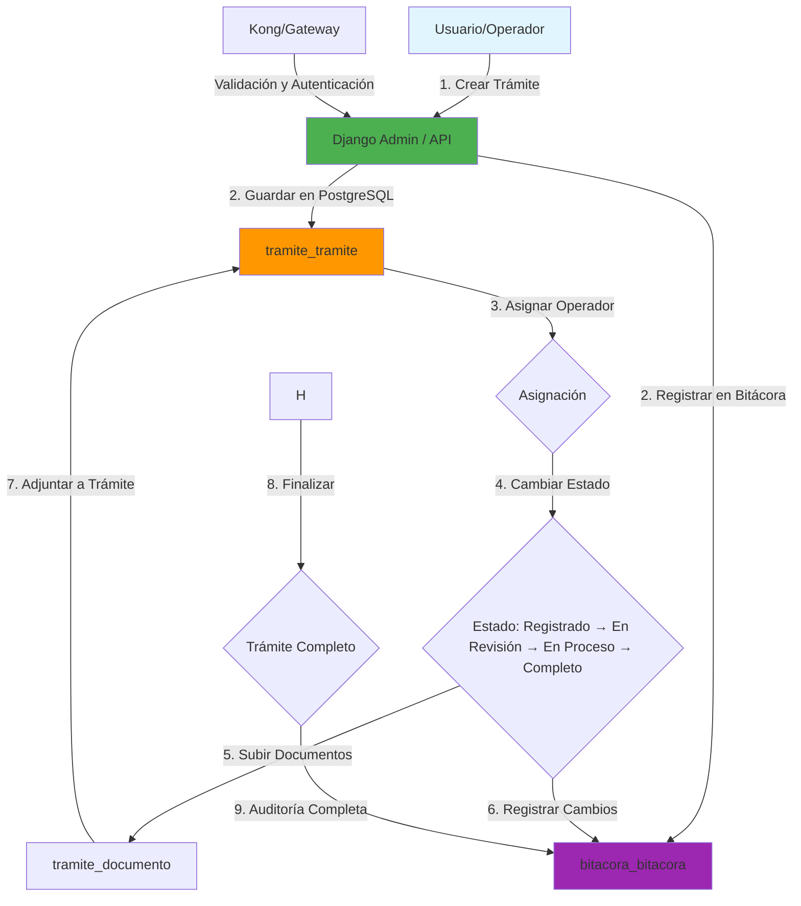
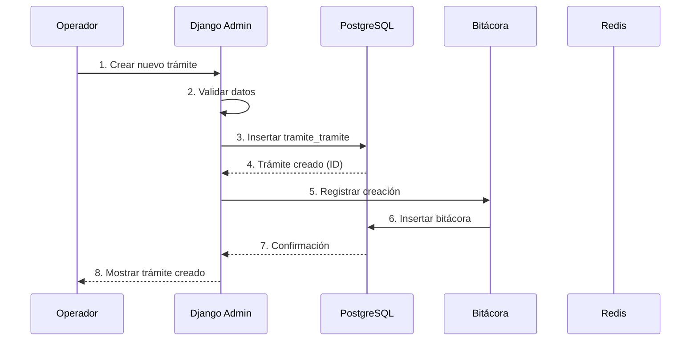
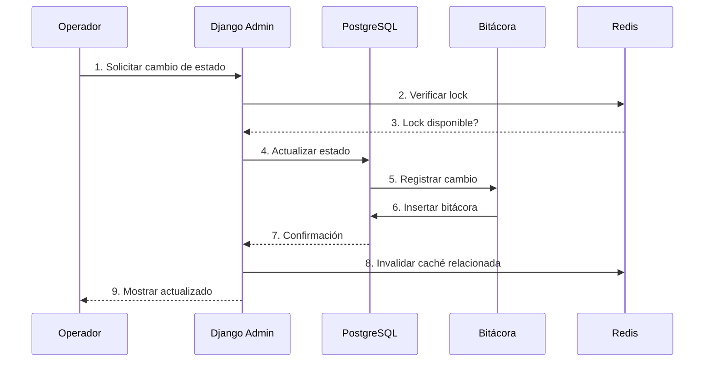

# Arquitectura del Backoffice de Trámites

> **Vista arquitectónica completa del sistema**
> Última actualización: 26 de Febrero de 2026

---

## Resumen

El Backoffice de Trámites utiliza una **arquitectura de microservicio** con **Django REST API** como backend principal. El sistema está diseñado para operar en la intranet del Gobierno de San Felipe con alta disponibilidad y seguridad.

---

## 📊 Diagrama de Arquitectura General

```
┌─────────────────────────────────────────────────────────────────┐
│                    INTRANET GUBERNAMENTAL                     │
├─────────────────────────────────────────────────────────────────┤
│                                                                │
│  ┌─────────────┐         ┌─────────────────────────────────┐   │
│  │  Frontend   │         │     Backoffice Trámites        │   │
│  │   (SPA)     │  API     │        (Django API)           │   │
│  │             │───────►│                             │   │
│  └─────────────┘         │                             │   │
│                           │  ┌────────────────────────┐  │   │
│                           │  │  Tramites (App)    │  │   │
│                           │  │                     │  │   │
│                           │  ┌────────────────────┐│  │   │
│                           │  │  Catalogos (App)   ││  │   │
│                           │  └────────────────────┘│  │   │
│                           │                     │  │   │
│                           │  ┌────────────────────┐│  │   │
│                           │  │  Bitacora (App)    ││  │   │
│                           │  └────────────────────┘│  │   │
│                           │                     │  │   │
│                           │  ┌────────────────────┐│  │   │
│                           │  │  Costos (App)      ││  │   │
│                           │  └────────────────────┘│  │   │
│                           │                     │  │   │
│                           │  ┌────────────────────┐│  │   │
│                           │  │  Core (Shared)     ││  │   │
│                           │  └────────────────────┘│  │   │
│                           └─────────────────────────────────┘   │
│                                     │                    │
│           ┌─────────────────────┼──────────────────────┐   │
│           ▼                     ▼                      ▼   │
│  ┌─────────────┐    ┌──────────────────┐             │   │
│  │  SQLite     │    │  PostgreSQL      │             │   │
│  │  (Django)   │    │  (Business DB)   │             │   │
│  │  Auth/Session│    │                 │             │   │
│  └─────────────┘    │  - Tramites     │             │   │
│                       │  - Catalogos     │             │   │
│                       │  - Costos        │             │   │
│                       │  - Bitacora      │             │   │
│                       └──────────────────┘             │   │
│                                                  │
│             ┌──────────────────────────────┐             │
│             ▼                              │             │
│      ┌────────────┐                    │             │
│      │   Redis     │  Cache/Locking       │             │
│      │            │                      │             │
│      └────────────┘                      │             │
│                                             │
└─────────────────────────────────────────────────────┘
```

---

## 🔑 Componentes Principales

### 1. Django REST API

**Propósito**: API REST principal que gestiona todas las operaciones de negocio.

**Características**:
- ✅ Autenticación y autorización
- ✅ CRUD completo para trámites
- ✅ Gestión de catálogos
- ✅ Sistema de costos
- ✅ Auditoría completa (bitácora)
- ✅ Validación de datos
- ✅ Manejo de errores

**Tecnologías**:
- Django 6.0.2
- Django REST Framework (DRF)
- Python 3.14

---

### 2. Django Admin Interface

**Propósito**: Interface administrativa integrada para gestión visual.

**Características**:
- ✅ CRUD visual para todas las entidades
- ✅ Búsqueda y filtrado integrados
- ✅ Acciones en lote (bulk actions)
- ✅ Permisos basados en roles
- ✅ Exportación de datos
- ✅ Personalización con CSS/JS

**Por qué Django Admin**:
- Desarrollo rápido (no requiere frontend custom)
- Seguridad integrada
- Mantenimiento sencillo
- Consistencia en toda la aplicación

---

## 💾 Arquitectura de Datos

### Base de Datos Dual

El sistema utiliza **dos bases de datos separadas** por diseño:

#### Base de Datos 1: SQLite (Django)

**Propósito**: Almacenar datos internos del framework Django.

**Contenido**:
```
┌─────────────────────────────────┐
│  SQLite Database             │
├─────────────────────────────────┤
│  django_migrations          │  Metadatos de migraciones
│  auth_user                  │  Usuarios del sistema
│  auth_group                 │  Grupos de usuarios
│  auth_permission            │  Permisos
│  django_admin_log           │  Logs de admin
│  django_session             │  Sesiones de usuario
└─────────────────────────────────┘
```

**Características**:
- ✅ Liviano y sin configuración externa
- ✅ Gestionado por Django (usa migraciones normales)
- ✅ Solo para datos internos del framework

---

#### Base de Datos 2: PostgreSQL (Business Data)

**Propósito**: Almacenar todos los datos de negocio del sistema.

**Contenido**:
```
┌─────────────────────────────────────┐
│  PostgreSQL Business Database      │
├─────────────────────────────────────┤
│  tramite_tramite               │  Trámites
│  tramite_documento              │  Documentos de trámites
│  tramite_historialtramite       │  Historial de cambios
│  catalogos_tipo_tramite        │  Tipos de trámites
│  catalogos_estatus              │  Estados de trámites
│  catalogos_requisito           │  Requisitos
│  catalogos_perito               │  Peritos especializados
│  catalogos_* (otras tablas)    │  Otros catálogos
│  costos_*                       │  Sistema de costos
│  bitacora_bitacora             │  Auditoría
└─────────────────────────────────────┘
```

**Características**:
- ✅ **No usa migraciones de Django** - esquema SQL directo
- ✅ Gestionado por equipo de base de datos externo
- ✅ Validación con schema validator
- ✅ Scripts SQL en `sql/migrations/`

---

### ¿Por qué Dos Bases de Datos?

**Ventajas**:
1. **Independencia**: Los datos de negocio pueden cambiar sin afectar Django
2. **Especialización**: Equipo de DB maneja datos de negocio, devs manejan app
3. **Migraciones controladas**: Esquema de negocio es responsabilidad del equipo DB
4. **Separación de responsabilidades**: Código vs datos separados
5. **Flexibilidad**: Permite integraciones con sistemas legacy

**Trade-offs**:
- ❌ Requiere coordinación entre equipos
- ❌ Validación manual de sincronización
- ❌ Schema validator necesario para detectar desincronizaciones

**Ver más**: [ADR-002: Configuración de Múltiples Bases de Datos](../06-decisions/002-configuracion-multiples-bases-de-datos.md)
[Concepto: Dual Database](../04-concepts/dual-database.md)

---

## 🔄 Flujo de Datos

### Diagrama de Flujo de Trámite



---

## 🚀 Arquitectura de Deploy

### Entorno de Producción

```
┌─────────────────────────────────────────────────────────────┐
│                   DOKER COMPOSE                      │
├─────────────────────────────────────────────────────────────┤
│                                                           │
│  ┌─────────────────────────────────────────────────┐    │
│  │  backoffice:                               │    │
│  │  ┌─────────────────────────────────────┐   │    │
│  │  │  Django Application              │   │    │
│  │  │  - Gunicorn (4 workers)       │   │    │
│  │  │  - Port 8090                    │   │    │
│  │  └─────────────────────────────────────┘   │    │
│  │            │                              │    │
│  │            ├──► PostgreSQL              │    │
│  │            │   - Port 5432              │    │
│  │            │   - Persistent Volume        │    │
│  │            │                              │    │
│  └─────────────────────────────────────────────────┘    │
│                                                           │
│  ┌─────────────────────────────────────────────────┐    │
│  │  postgres:                                 │    │
│  │  - PostgreSQL Database                  │    │
│  │  - Port 5432                           │    │
│  │  - Environment Variables                 │    │
│  │  - Health Check                        │    │
│  └─────────────────────────────────────────────────┘    │
│                                                           │
│  ┌─────────────────────────────────────────────────┐    │
│  │  redis:                                   │    │
│  │  - Redis Server                         │    │
│  │  - Port 6379                           │    │
│  │  - For Caching                           │    │
│  └─────────────────────────────────────────────────┘    │
│                                                           │
└─────────────────────────────────────────────────────────────┘
                     │
                     ▼
            ┌─────────────────────┐
            │  Intranet Proxy   │
            │  (Kong/Nginx)     │
            │  - TLS/SSL         │
            │  - Auth Gateway     │
            └─────────────────────┘
```

---

## 🔐 Seguridad y Autenticación

### Modelo de Autenticación

```
┌─────────────────────────────────────────────────────────┐
│                  Usuario                          │
│              ↓ (Credenciales)                     │
│  ┌──────────────────────────────────────────┐    │
│  │  Kong Gateway (Auth Provider)        │    │
│  │  - Token Validation                 │    │
│  │  - JWT Verification                │    │
│  │  - User Context Injection          │    │
│  └──────────────┬───────────────────────┘    │
│                 │                              │
│                 ↓ (request.user_id,            │
│                 │  request.username,              │
│                 │  request.roles)                 │
│  ┌──────────────────────────────────┐      │
│  │  Django Middleware            │      │
│  │  - Validates permissions      │      │
│  │  - Injects user object     │      │
│  │  - Logs all requests        │      │
│  └──────────────┬───────────────┘      │
│                 │                           │
│                 ↓                           │
│  ┌──────────────────────────────────┐      │
│  │  Django Views/API            │      │
│  │  - Business Logic            │      │
│  │  - Permission Checks         │      │
│  │  - Database Operations      │      │
│  └──────────────────────────────────┘      │
└─────────────────────────────────────────────────────┘
```

---

### Permisos y Roles

**Diseño de Permisos**:
- **Admin**: Acceso completo a Django Admin, configuración, todos los trámites
- **Operador**: Acceso solo a trámites asignados, creación limitada

**Modelo de Permisos Django**:
```python
# Admin permissions
admin.add_tramite
admin.change_tramite
admin.delete_tramite
admin.view_all_tramites

# Operator permissions
operator.view_assigned_tramites
operator.change_status_assigned
operator.add_document_assigned
```

**Ver más**: [ADR-006: Permisos de Admin y Operador](../06-decisions/006-permisos-admin-operador.md)

---

## 🚦 Caching Strategy

### Redis como Sistema de Caché

**Propósitos del Caché**:

1. **Sesiones Distribuidas**
   - Compartir sesiones entre múltiples instancias
   - Escalabilidad horizontal
   - TTL configurado (3600 segundos = 1 hora)

2. **Cache de Consultas**
   - Cachear resultados de consultas frecuentes
   - Catálogos estáticos (tipos, estatus, etc.)
   - Perfiles de usuario
   - Reducir carga en PostgreSQL

3. **Locking Distribuido**
   - Prevenir condiciones de carrera en operaciones críticas
   - Ej: Asignación de trámite
   - Expiración automática de locks

**TTL (Time-To-Live) Configurados**:
```
Sesiones:          3600 segundos (1 hora)
Catálogos:        86400 segundos (24 horas)
Permisos:         3600 segundos (1 hora)
Locks:             300 segundos (5 minutos)
```

**Ver más**: [ADR-003: Estrategia de Caching y Rendimiento](../06-decisions/003-estrategia-caching-rendimiento.md)
[Concepto: Caching Strategy](../04-concepts/caching-strategy.md)

---

## 📊 Auditoría y Bitácora

### Sistema de Auditoría

**Registro Completo de Cambios**:

Cada cambio en el sistema es registrado automáticamente:

```
┌─────────────────────────────────────────────────┐
│  Bitacora (Audit Log)                    │
├─────────────────────────────────────────────────┤
│  - id: ID único del registro              │
│  - tramite_numero: Trámite afectado       │
│  - usuario_user_id: Usuario que hizo cambio │
│  - usuario_username: Username del usuario     │
│  - accion: Tipo de acción                │
│  - campo: Campo modificado                 │
│  - valor_anterior: Valor antes del cambio   │
│  - valor_nuevo: Valor después del cambio    │
│  - timestamp: Cuándo ocurrió              │
└─────────────────────────────────────────────────┘
```

**Tipos de Acciones Registradas**:
- `crear`: Creación de trámite
- `actualizar`: Actualización de campo
- `cambiar_status`: Cambio de estado
- `asignar`: Asignación de usuario
- `agregar_documento`: Adjuntar documento
- `eliminar`: Eliminación (lógica)

**Inserciones Automáticas**:
- La bitácora se inserta automáticamente en todos los cambios
- No requiere código explícito en vistas
- Django signals o middleware manejan el registro

**Ver más**: [Concepto: Sistema de Auditoría](../04-concepts/audit-system.md)

---

## 🔧 Denormalización Intencional

### Estrategia de Denormalización

El sistema denormaliza ciertos datos intencionalmente para mejorar rendimiento:

**Campos Denormalizados en Trámite**:
```python
class Tramite(models.Model):
    numero: str                          # PK
    tipo_codigo: str                      # Denormalizado
    tipo_nombre: str                      # Denormalizado (evita JOIN)
    creado_por_user_id: str               # Denormalizado
    creado_por_username: str              # Denormalizado (evita JOIN)
    asignado_a_user_id: str               # Denormalizado
    asignado_a_username: str              # Denormalizado (evita JOIN)
```

**Ventajas**:
- ✅ Mejor rendimiento de consultas (sin JOINs)
- ✅ Reducción de carga en base de datos
- ✅ Simplificación de queries complejas

**Trade-offs**:
- ❌ Redundancia de datos
- ❌ Requiere actualizaciones en múltiples lugares si cambia referencia
- ❌ Mayor uso de almacenamiento

**¿Por qué denormalizar?**
- El rendimiento es prioritario para este sistema
- Los datos maestros (tipos, usuarios) cambian raramente
- La redundancia es aceptable vs. el costo de JOINs constantes

**Ver más**: [ADR-004: Denormalización de Datos](../06-decisions/004-denormalizacion.md)
[Concepto: Denormalización](../04-concepts/denormalization.md)

---

## 📡 Logging y Monitoreo

### Configuración de Logging

**Niveles de Logging**:
```
DEBUG: Información detallada para desarrollo
INFO: Información normal de operación
WARNING: Algo inesperado pero no crítico
ERROR: Error que requiere atención
CRITICAL: Error crítico que requiere acción inmediata
```

**Archivos de Log**:
```
logs/
├── django.log           # Logs de la aplicación Django
├── gunicorn-access.log  # Logs de acceso HTTP
├── gunicorn-error.log   # Logs de errores Gunicorn
└── api.log             # Logs específicos de API
```

**Rotación de Logs**:
- Tamaño máximo: 10 MB por archivo
- Históricos: Hasta 10 archivos
- Rotación automática por tamaño

---

## 🔄 Arquitectura Sin Migraciones

### Estrategia de Gestión de Esquema

**¿Por qué NO usar migraciones de Django?**

```
┌─────────────────────────────────────────────────┐
│  Django ORM Migrations                   │
├─────────────────────────────────────────────┤
│  ✅ Automáticas                            │
│  ✅ Reversibles                            │
│  ✅ Control de versiones                    │
│  ❌ No usado para PostgreSQL (Business DB)     │
└─────────────────────────────────────────────────┘

┌─────────────────────────────────────────────────┐
│  SQL Schema Management                     │
├─────────────────────────────────────────────┤
│  ✅ Scripts SQL manuales                  │
│  ✅ Gestionado por equipo DB externo        │
│  ✅ Schema Validator para validación        │
│  ✅ Scripts en sql/migrations/            │
└─────────────────────────────────────────────────┘
```

**Proceso de Actualización de Esquema**:
1. Equipo de base de datos crea nuevos scripts SQL
2. Scripts se colocan en `sql/migrations/`
3. Schema Validator detecta cambios en modelos Django
4. Desarrollador actualiza modelos Django manualmente
5. Schema Validator valida sincronización

**Schema Validator**:
- Compara modelos Django con esquema PostgreSQL
- Reporta discrepancias
- Genera SQL sugerido
- **Ver más**: [Referencia: Schema Validator](../05-reference/components/schema-validator.md)
- **Guía**: [Debug Schema Validator](../03-guides/developers/debug-schema.md)

**Ver más**: [ADR-002: Sin Migraciones + Schema Validator](../06-decisions/002-configuracion-multiples-bases-de-datos.md)
[Concepto: No Migrations](../04-concepts/no-migrations.md)

---

## 🌐 Capas de la Arquitectura

### Capa de Presentación
- **Django Admin**: Interface principal de usuario
- **API REST**: Para integraciones externas
- **Health Check**: Endpoint `/health/`

### Capa de Lógica de Negocio
- **Apps de Django**: tramites, catalogos, costos, bitacora
- **Validación**: En niveles de modelos y formularios
- **Auditoría**: Automática en cambios

### Capa de Acceso a Datos
- **SQLite**: Para datos internos de Django
- **PostgreSQL**: Para datos de negocio
- **Schema Router**: Router Django para separar DBs

### Capa de Caché
- **Redis**: Sistema de caché distribuido
- **Session Store**: Sesiones distribuidas
- **Query Cache**: Caché de consultas

---

## 📊 Diagramas de Secuencias

### Flujo de Creación de Trámite



### Flujo de Cambio de Estado



---

## 🚀 Escalabilidad

### Escalabilidad Vertical
- Aumentar recursos del servidor
- Más CPUs = más Gunicorn workers
- Más RAM = más caché en memoria

### Escalabilidad Horizontal
- Múltiples instancias de Docker
- Balanceo de carga (Kong/Nginx)
- Sesiones en Redis compartidas
- Cache distribuido

---

## 📋 Checklist de Arquitectura

### Componentes Implementados

- ✅ Django REST API
- ✅ Django Admin Interface
- ✅ Base de Datos Dual (SQLite + PostgreSQL)
- ✅ Sistema de Caché (Redis)
- ✅ Auditoría Completa (Bitácora)
- ✅ Schema Validator (sin migraciones)
- ✅ Denormalización de Datos
- ✅ Sistema de Permisos (Admin/Operador)
- ✅ Logging y Monitoreo
- ✅ Health Checks
- ✅ Docker Compose

### Decisiones Arquitectónicas

- ✅ ADR-001: Selección de Stack Base
- ✅ ADR-002: Múltiples Bases de Datos
- ✅ ADR-003: Estrategia de Caching
- ✅ ADR-004: Denormalización de Datos
- ✅ ADR-005: Despliegue con Docker y Gunicorn
- ✅ ADR-006: Permisos de Admin y Operador

---

## 🔗 Referencias

### Documentación Relacionada

- [Overview del Proyecto](./overview.md) - ¿Qué es este proyecto?
- [Glosario de Términos](./glossary.md) - Términos del dominio
- [Decisiones de Arquitectura](../06-decisions/README.md) - ADRs completos
- [Conceptos de Arquitectura](../04-concepts/) - Explicaciones detalladas
- [Referencia Técnica](../05-reference/) - Documentación completa

### Tecnologías

- [Django Documentation](https://docs.djangoproject.com/)
- [Django REST Framework](https://www.django-rest-framework.org/)
- [PostgreSQL Documentation](https://www.postgresql.org/docs/)
- [Redis Documentation](https://redis.io/documentation)
- [Gunicorn Documentation](https://docs.gunicorn.org/)

---

**¿Preguntas sobre la arquitectura?**
- Revisa los [ADRs](../06-decisions/README.md) para decisiones específicas
- Consulta [Documentación de Conceptos](../04-concepts/) para explicaciones
- Contacta al equipo técnico para aclaraciones

---

*Última actualización: 26 de Febrero de 2026*
