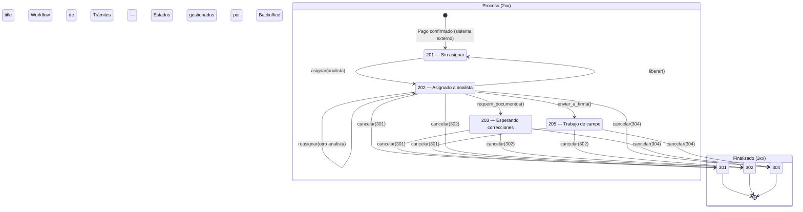
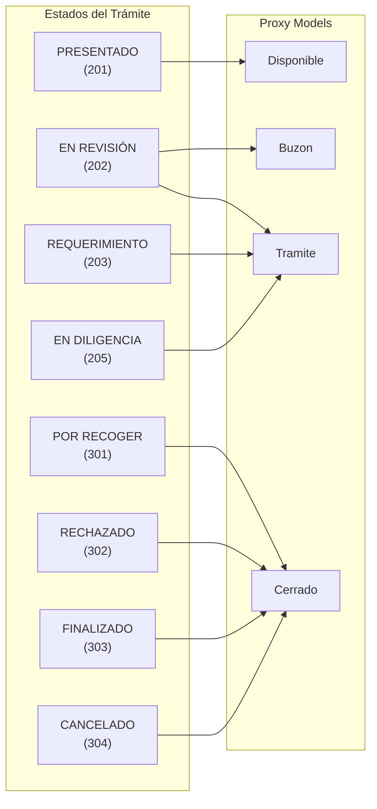

# Workflow de Trámites — Guía para Desarrolladores

> **Fuente de verdad:** `tramites/models/tramite.py` (`TRANSITIONS` dict + métodos de acción)
> Última actualización: 9 de mayo de 2026

______________________________________________________________________

## Resumen

El workflow de trámites es una máquina de estados finitos implementada como un diccionario `TRANSITIONS` en el modelo `Tramite`. Cada transición de estado está definida explícitamente como `(from_status, to_status) → True`, y los métodos de acción (`asignar`, `requerir_documentos`, `enviar_a_firma`, `cancelar`) validan contra este diccionario antes de ejecutarse.

Este documento describe los estados, transiciones, acciones, permisos y el flujo típico de un trámite desde su creación hasta su cancelación.

______________________________________________________________________

## 1. Estados del Workflow

Los estados están definidos en `TramiteEstatus.Estatus` (`tramites/models/catalogos.py`) como `IntegerChoices`. Se agrupan en tres rangos por prefijo:

| Código | Constante | Responsable | Descripción |
|--------|-----------|-------------|-------------|
| **Inicio (1xx)** | | | |
| 101 | `BORRADOR` | Ciudadano | El ciudadano captura información y sube requisitos. Sin validez oficial. |
| 102 | `PENDIENTE_PAGO` | Ciudadano | El trámite está bloqueado esperando confirmación de pago. |
| 103 | `PAGO_EXPIRADO` | Sistema | La línea de captura venció y el trámite se detuvo por falta de pago. |
| **Proceso (2xx)** | | | |
| 201 | `PRESENTADO` | Sistema | El pago se confirmó y el trámite entró oficialmente a la bandeja de la dependencia. Sin asignar. |
| 202 | `EN_REVISION` | Funcionario | Un analista ha tomado el expediente para validar documentos y datos. |
| 203 | `REQUERIMIENTO` | Ciudadano | Se detectó error o falta de información. El ciudadano debe corregir. |
| 204 | `SUBSANADO` | Funcionario | El ciudadano respondió al requerimiento. El trámite vuelve a la fila de revisión. |
| 205 | `EN_DILIGENCIA` | Perito | Fase de campo: mediciones, inspecciones, deslindes, etc. |
| **Finalizado (3xx)** | | | |
| 301 | `POR_RECOGER` | Ciudadano | El documento final está disponible para descarga o recolección. |
| 302 | `RECHAZADO` | Funcionario | Resolución negativa: no procedió legal o técnicamente. |
| 303 | `FINALIZADO` | Sistema | El ciudadano recibió su documento y el expediente se cierra. |
| 304 | `CANCELADO` | Sistema | Trámite interrumpido por el ciudadano o impedimento administrativo. |

> **Nota:** Los estados 1xx (inicio) son gestionados por el sistema externo de portal ciudadano. El backoffice solo gestiona los estados 2xx y las transiciones hacia 3xx. El estado 303 (`FINALIZADO`) se alcanza desde `POR_RECOGER` vía el sistema externo, no desde el backoffice.

### Helper: `es_activo()`

El class method `TramiteEstatus.Estatus.es_activo(estatus)` retorna `True` para los estados de proceso activo:

```python
@classmethod
def es_activo(cls, estatus: int) -> bool:
    return estatus in (
        cls.PRESENTADO,      # 201
        cls.EN_REVISION,     # 202
        cls.REQUERIMIENTO,   # 203
        cls.SUBSANADO,       # 204
        cls.EN_DILIGENCIA,   # 205
    )
```

______________________________________________________________________

## 2. Transiciones Válidas

El dict `TRANSITIONS` en `tramites/models/tramite.py` define todas las transiciones permitidas. Cada entrada es `(from_status, to_status) → True`:

```python
TRANSITIONS: dict[tuple[int, int], bool] = {
    # Asignar: presentado → en revisión
    (201, 202): True,
    # Reasignar: en revisión → en revisión (cambio de analista)
    (202, 202): True,
    # Liberar: en revisión → presentado (volver al pool)
    (202, 201): True,
    # Requerir documentos: en revisión → requerimiento
    (202, 203): True,
    # Enviar a firma: en revisión → en diligencia
    (202, 205): True,
    # Cancelar desde estados activos → estados terminales
    (202, 301): True,  # por recoger
    (202, 302): True,  # rechazado
    (202, 304): True,  # cancelado
    (203, 301): True,  # por recoger
    (203, 302): True,  # rechazado
    (203, 304): True,  # cancelado
    (205, 301): True,  # por recoger
    (205, 302): True,  # rechazado
    (205, 304): True,  # cancelado
}
```

### Diagrama de estados



### Validación de transiciones

El método `_validate_transition(to_status)` valida que la transición exista en el dict:

```python
def _validate_transition(self, to_status: int) -> None:
    from_status = self.ultima_actividad_estatus_id
    if (from_status, to_status) not in TRANSITIONS:
        raise EstadoNoPermitidoError(
            f'No es posible realizar esta acción en el estatus actual '
            f'del trámite {self.folio} (estatus actual: {from_status}).'
        )
```

**Agregar una transición nueva = agregar una línea al dict.** No se necesita modificar lógica en los métodos de acción.

______________________________________________________________________

## 3. Acciones del Workflow

Los métodos de acción viven en el modelo `Tramite` y son la API pública para cambiar el estado de un trámite. Cada acción valida la transición, verifica la asignación y registra una actividad.

### Resumen de acciones

| Método | Transición | Permisos requeridos | Descripción |
|--------|------------|---------------------|-------------|
| `asignar()` | 201→202, 202→202, →201 | `can_assign()` o `can_execute_action()` | Asignar, reasignar o liberar un trámite |
| `requerir_documentos()` | 202→203 | `can_execute_action()` | Requiere documentos adicionales al ciudadano |
| `enviar_a_firma()` | 202→205 | `can_execute_action()` | Envía el trámite a firma |
| `cancelar()` | 202/203/205→301/302/304 | `can_execute_action()` | Cancela el trámite con un estatus terminal |

### `asignar(analista, asignado_por, observacion='')`

Método polimórfico que maneja tres casos según el valor de `analista`:

| `analista` | Comportamiento | Transición |
|------------|----------------|------------|
| `User` (nuevo analista, != actual) | Reasignar | 202→202 o 201→202 |
| `User` (mismo analista actual) | Ignorar (silencioso) | — |
| `None` | Liberar al pool | Cualquier activo → 201 |

**Validaciones:**

1. `_assert_activo()` — el trámite debe estar en estado activo
1. `_validate_transition(EN_REVISION)` — la transición debe existir en `TRANSITIONS` (solo para asignar/reasignar, no para liberar)
1. Si ya está asignado al mismo analista, sale silenciosamente sin crear actividad

**Ejemplo de uso:**

```python
# Asignar trámite a un analista
tramite.asignar(analista=ana, asignado_por=coordinador)

# Autoasignar (analista toma el trámite del pool)
tramite.asignar(analista=ana, asignado_por=ana)

# Liberar trámite (volver al pool)
tramite.asignar(analista=None, asignado_por=coordinador)
```

### `requerir_documentos(analista, observacion)`

Requiere documentos adicionales al ciudadano. Solo aplica cuando el trámite está en revisión.

**Validaciones:**

1. `_assert_activo()` — estado activo
1. `_validate_transition(REQUERIMIENTO)` — transición (202→203) válida
1. `_assert_asignado_a(analista)` — el trámite debe estar asignado al usuario que ejecuta

**Ejemplo:**

```python
tramite.requerir_documentos(
    analista=request.user,
    observacion='Falta comprobante de domicilio actualizado',
)
```

### `enviar_a_firma(analista, observacion)`

Pone el trámite en fase de campo (inspecciones, mediciones, etc.).

**Validaciones:** mismas que `requerir_documentos`, pero validando transición (202→205).

**Ejemplo:**

```python
tramite.enviar_a_firma(
    analista=request.user,
    observacion='Se requiere inspección ocular del inmueble',
)
```

### `cancelar(analista, estatus_cierre, observacion)`

Cancela el trámite con un estatus terminal. Es la acción más estricta: requiere observación obligatoria.

**Validaciones:**

1. `observacion` debe ser texto no vacío (si no, `ValueError`)
1. `estatus_cierre` debe ser `POR_RECOGER` (301), `RECHAZADO` (302) o `CANCELADO` (304)
1. `_assert_activo()` — estado activo
1. `_validate_transition(estatus_cierre)` — transición válida
1. `_assert_asignado_a(analista)` — asignado al usuario que ejecuta

**Ejemplo:**

```python
tramite.cancelar(
    analista=request.user,
    estatus_cierre=TramiteEstatus.Estatus.POR_RECOGER,
    observacion='Documentación completa. Listo para entrega.',
)
```

### Métodos internos

| Método | Descripción |
|--------|-------------|
| `_assert_activo()` | Lanza `TramiteNoAsignableError` si el estatus no es activo (no está en 201–205) |
| `_assert_asignado_a(usuario)` | Lanza `PermissionDenied` si `asignado_user_id != usuario.id` |
| `_validate_transition(to_status)` | Lanza `EstadoNoPermitidoError` si `(from, to)` no está en `TRANSITIONS` |
| `_liberar(liberado_por, observacion)` | Caso interno de `asignar(None, ...)` — solo valida `_assert_activo()` |
| `_asignar_analista(analista, asignado_por, observacion)` | Caso interno de `asignar(user, ...)` — valida transición |
| `registrar_actividad(estatus_id, analista_id, observacion)` | Crea un registro en la tabla `Actividades` (APPEND_ONLY) |

**Excepción notada:** `_liberar()` usa `_assert_activo()` pero **no** `_validate_transition()`. La liberación es un "reset" que puede aplicarse desde cualquier estado activo, y la transición `(activo, 201)` no siempre está en `TRANSITIONS`. El sistema confía en que `_assert_activo()` es suficiente.

______________________________________________________________________

## 4. Permisos por Estado

Los permisos se controlan mediante métodos en el modelo `Tramite` (patrón Fat Models). Cada método evalúa el rol del usuario y el estado actual.

### Métodos de permisos

| Método | Retorna | Descripción |
|--------|---------|-------------|
| `can_view(user)` | `bool` | ¿Puede ver el detalle del trámite? |
| `can_download(user)` | `bool` | ¿Puede descargar documentos? |
| `can_assign(user)` | `bool` | ¿Puede asignar/reasignar? |
| `can_release(user)` | `bool` | ¿Puede liberar al pool? |
| `can_execute_action(user)` | `bool` | ¿Puede ejecutar acciones de workflow? |
| `available_actions(user)` | `list[str]` | Lista de acciones disponibles según rol + estatus |

### Matriz de permisos por rol

#### Ver y descargar

| Rol | `can_view()` | `can_download()` |
|-----|-------------|-----------------|
| Superuser / Administrador | Siempre | Siempre |
| Coordinador | Siempre | Siempre |
| Analista | Solo si está asignado al trámite | Si asignado, o si trámite disponible y activo |

#### Gestionar asignaciones

| Rol | `can_assign()` | `can_release()` |
|-----|---------------|----------------|
| Superuser / Administrador | ✅ | ✅ |
| Coordinador | ✅ | ✅ |
| Analista | ❌ | ❌ |

#### Ejecutar acciones de workflow

| Rol | `can_execute_action()` |
|-----|----------------------|
| Superuser / Administrador | Siempre |
| Coordinador | Siempre |
| Analista | Solo si está asignado al trámite |

### Acciones disponibles por estatus

El método `available_actions(user)` combina `can_execute_action()` con el estatus actual:

| Estatus actual | Acciones disponibles |
|----------------|---------------------|
| `EN_REVISION` (202) | `['requerir_documentos', 'enviar_a_firma', 'cancelar']` |
| `REQUERIMIENTO` (203) | `['cancelar']` |
| `EN_DILIGENCIA` (205) | `['cancelar']` |
| Otro estatus | `[]` (sin acciones) |

Si `can_execute_action(user)` retorna `False`, `available_actions` retorna `[]` independientemente del estatus.

### Consumidores de permisos

| Consumidor | Métodos usados |
|------------|---------------|
| `tramites/admin.py` (change_view) | `can_view()` para protección IDOR; `available_actions()` para POST y template |
| `tramites/admin.py` (liberar_rapido) | `can_release()` |
| `tramites/admin.py` (acciones_disponibles) | `can_release()` para mostrar botón de liberar |
| `tramites/views.py` (download_requisito_pdf) | `can_download()` |
| `templates/admin/tramite_detail.html` | `` para botones condicionales |

______________________________________________________________________

## 5. Flujo Típico

Este es el recorrido completo de un trámite desde que llega al backoffice hasta su cancelación:

### Paso 1: Llegada al backoffice (estado 201 — PRESENTADO)

El ciudadano completa su trámite en el portal externo y confirma el pago. El sistema externo cambia el estatus a `PRESENTADO` (201). El trámite aparece en el listado de **Trámites Disponibles** (`Disponible`) sin analista asignado.

```
asignado_user_id = NULL
estatus = 201 (PRESENTADO)
```

### Paso 2: Asignación (201 → 202)

Un **Coordinador** asigna el trámite a un analista, o un **Analista** lo autoasigna desde el listado de disponibles.

```python
# Coordinador asigna
tramite.asignar(analista=analista_lopez, asignado_por=coordinador_garcia)

# Analista autoasigna
tramite.asignar(analista=analista_lopez, asignado_por=analista_lopez)
```

El trámite pasa a `EN_REVISION` (202) y se asigna `asignado_user_id = analista.id`.

### Paso 3: Revisión — tomar acción

El analista revisa la documentación y puede ejecutar una de tres acciones:

#### Opción A: Requerir documentos (202 → 203)

El expediente tiene información incompleta o errores:

```python
tramite.requerir_documentos(
    analista=analista_lopez,
    observacion='Falta acta de nacimiento actualizada',
)
```

El estatus cambia a `REQUERIMIENTO` (203). Desde este estado, la única acción disponible es `cancelar`.

#### Opción B: Enviar a firma (202 → 205)

Se requiere trabajo de campo (inspección, medición):

```python
tramite.enviar_a_firma(
    analista=analista_lopez,
    observacion='Inspección ocular requerida para deslinde',
)
```

El estatus cambia a `EN_DILIGENCIA` (205). Desde este estado, la única acción disponible es `cancelar`.

#### Opción C: Cancelar directamente (202 → 301/302/304)

La documentación es suficiente para una resolución:

```python
# Dictamen positivo
tramite.cancelar(
    analista=analista_lopez,
    estatus_cierre=TramiteEstatus.Estatus.POR_RECOGER,
    observacion='Documentación completa y verificada.',
)

# Rechazo
tramite.cancelar(
    analista=analista_lopez,
    estatus_cierre=TramiteEstatus.Estatus.RECHAZADO,
    observacion='No cumple con los requisitos del artículo 14.',
)

# Cancelación
tramite.cancelar(
    analista=analista_lopez,
    estatus_cierre=TramiteEstatus.Estatus.CANCELADO,
    observacion='Solicitud de cancelación por el ciudadano.',
)
```

### Paso 4: Cancelación desde estados intermedios (203/205 → 301/302/304)

Si el trámite está en `REQUERIMIENTO` (203) o `EN_DILIGENCIA` (205), se puede cancelar con cualquier estatus terminal:

```python
# Cancelar desde requerimiento
tramite.cancelar(analista=analista, estatus_cierre=301, observacion='...')

# Cancelar desde diligencia
tramite.cancelar(analista=analista, estatus_cierre=304, observacion='...')
```

### Paso 5: Finalización completa (301 → 303)

El estado `POR_RECOGER` (301) indica que el documento está listo. Cuando el ciudadano lo recoge (física o digitalmente), el sistema externo cambia el estatus a `FINALIZADO` (303). **El backoffice no gestiona esta transición.**

### Acciones transversales: Reasignar y Liberar

En cualquier punto del proceso activo, un **Coordinador** o **Administrador** puede:

```python
# Reasignar a otro analista (202 → 202)
tramite.asignar(analista=analista_martinez, asignado_por=coordinador_garcia)

# Liberar al pool (cualquier activo → 201)
tramite.asignar(analista=None, asignado_por=coordinador_garcia)
```

______________________________________________________________________

## 6. Proxy Models en el Workflow

Los proxy models (`Buzon`, `Disponible`, `Tramite`, `Cerrado`) son vistas filtradas del mismo modelo base, diseñadas para controlar qué trámites ve cada rol en el admin de Django.

| Proxy Model | Filtros | Roles | Sección en sidebar |
|-------------|---------|-------|--------------------|
| `Tramite` | Estatus activos (201–205) | Administrador, Coordinador | "Trámites en curso" |
| `Buzon` | `asignado_user_id == request.user.id` + activos | Analista | "Mis trámites" |
| `Disponible` | `asignado_user_id IS NULL` + estatus 201 | Todos los roles | "Disponibles" |
| `Cerrado` | Estatus finalizados (301–304) | Coordinador | "Finalizados" |

### Cómo se relacionan con el workflow



### Definiciones

#### `Disponible` — Trámites sin asignar

Solo muestra trámites en estatus `PRESENTADO` (201) sin analista asignado. El analista puede autoasignarse ("Tomar"), y el coordinador puede asignar a un analista específico.

```python
class Disponible(Tramite):
    class Meta:
        proxy = True
        verbose_name = 'Trámite disponible para autoasignación'
        verbose_name_plural = 'Trámites disponibles'
```

#### `Buzon` — Mis trámites

Solo muestra trámites asignados al usuario actual (`asignado_user_id == request.user.id`) en estados activos. Es la vista principal del analista.

```python
class Buzon(Tramite):
    class Meta:
        proxy = True
        verbose_name = 'Mis trámites'
        verbose_name_plural = 'Buzón de trámites'
```

#### `Tramite` — Todos los trámites activos

Muestra todos los trámites en estados activos (201–205) sin filtro de asignación. Vista para administradores y coordinadores.

#### `Cerrado` — Trámites finalizados

Muestra trámites en estados terminales (301–304). Solo visible para coordinadores y administradores.

```python
class Cerrado(Tramite):
    class Meta:
        proxy = True
        verbose_name = 'Trámites finalizados'
        verbose_name_plural = 'Trámites finalizados'
```

______________________________________________________________________

## 7. Personalización

### Agregar una nueva transición

Para habilitar una transición entre dos estados existentes:

1. **Agregar la entrada al dict `TRANSITIONS`** en `tramites/models/tramite.py`:

```python
TRANSITIONS: dict[tuple[int, int], bool] = {
    # ... transiciones existentes ...
    # Nueva transición: requerimiento → en revisión (retorno de subsanación)
    (TramiteEstatus.Estatus.REQUERIMIENTO, TramiteEstatus.Estatus.EN_REVISION): True,
}
```

2. **Si corresponde, actualizar `available_actions()`** para que el template muestre la acción en el nuevo estatus:

```python
def available_actions(self, user: User) -> list[str]:
    # ...
    if status == TramiteEstatus.Estatus.REQUERIMIENTO:
        actions.extend(['reanudar_revision', 'cancelar'])
    # ...
```

3. **Crear un ADR** en `docs/02-DECISIONES/` documentando la razón de la nueva transición.

1. **Agregar tests** en `tests/tramites/test_models.py`:

```python
def test_requerimiento_to_en_revision():
    """La transición REQUERIMIENTO → EN_REVISION es válida."""
    assert (203, 202) in TRANSITIONS
```

### Agregar un nuevo estado

Los estados viven en la tabla legacy `cat_estatus` y en `TramiteEstatus.Estatus`. Para agregar uno nuevo:

1. **Insertar en la base de datos** (`cat_estatus`) — vía migración SQL o DBA

1. **Agregar la constante** en `TramiteEstatus.Estatus` (`tramites/models/catalogos.py`):

```python
class Estatus(models.IntegerChoices):
    # ... existentes ...
    NUEVO_ESTADO = 206, 'NUEVO ESTADO'
```

3. **Actualizar `es_activo()`** si el nuevo estado es un estado activo:

```python
@classmethod
def es_activo(cls, estatus: int) -> bool:
    return estatus in (
        cls.PRESENTADO,
        cls.EN_REVISION,
        cls.REQUERIMIENTO,
        cls.SUBSANADO,
        cls.EN_DILIGENCIA,
        cls.NUEVO_ESTADO,  # nuevo
    )
```

4. **Agregar transiciones** al dict `TRANSITIONS` según corresponda

1. **Crear un ADR** documentando la decisión (siguiendo el formato MADR en `docs/02-DECISIONES/`)

1. **Actualizar tests y documentación**

### Proceso ADR

Toda modificación al workflow (nueva transición, nuevo estado, cambio de permisos) debe documentarse como un ADR (Architecture Decision Record) en `docs/02-DECISIONES/`. Seguir el formato MADR:

- **Contexto**: qué problema se está resolviendo
- **Opciones consideradas**: alternativas evaluadas
- **Decisión**: qué se eligió y por qué
- **Consecuencias**: impacto esperado (positivo y negativo)

> **Referencia:** [ADR-014: Custom User Model, Workflow Refactoring, Permission Methods](../02-DECISIONES/014-custom-user-workflow-permissions.md)

______________________________________________________________________

## Ver también

- [Referencia RBAC](rbac.md) — Roles, permisos y proxy models
- [Modelo de Datos](../01-ARQUITECTURA/03-MODELO-DE-DATOS.md) — Diagrama ERD y acceso a datos
- [Estados de Trámites](./workflow.md) — Descripción detallada de cada estado
- [ADR-014: Workflow Permissions](../02-DECISIONES/014-custom-user-workflow-permissions.md) — Decisión de arquitectura
- [Código fuente](../../tramites/models/tramite.py) — `TRANSITIONS` dict + métodos de acción
- [Catálogo de estatus](../../tramites/models/catalogos.py) — `TramiteEstatus.Estatus`
