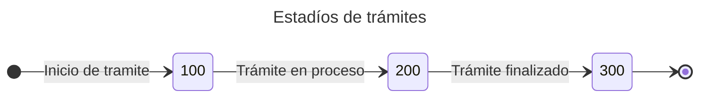
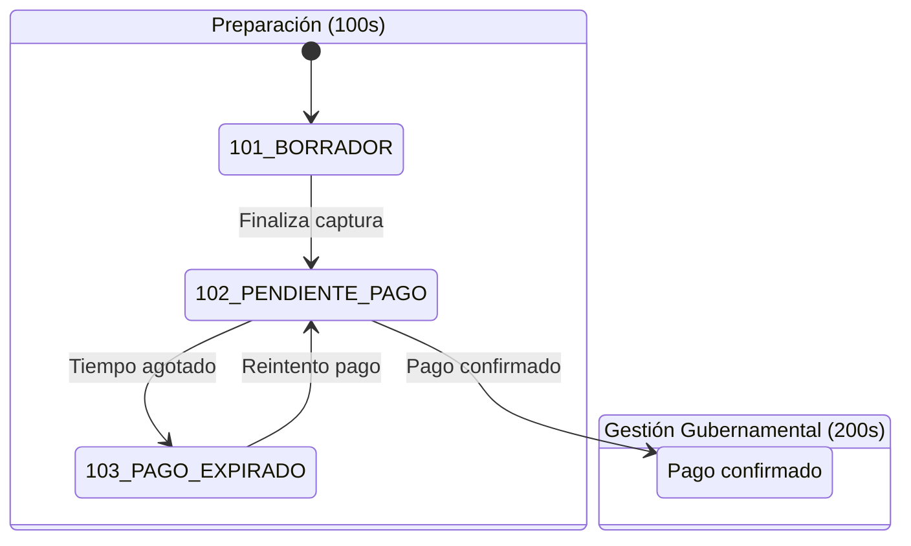
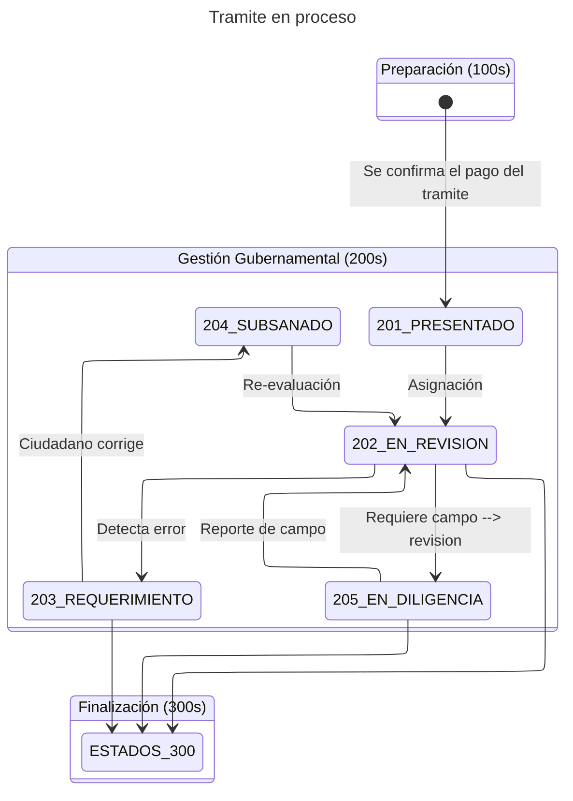

# Sistema de estados de Gestión de Trámites

Los estados por los que puede pasar un tramite estan catalogados en tres estados principales: Inicio, Proceso y Finalizado.




Esta es una descripción de los estados.

| ID  | Token de Estado | Responsable | Descripción del Proceso |
| --- | --------------- | ----------- | ----------------------- |
| 101 | BORRADOR        | Ciudadano   | El ciudadano está capturando información y subiendo requisitos. No tiene validez oficial aún. |
| 102 | PENDIENTE_PAGO  | Ciudadano   | El trámite está bloqueado esperando que se confirme el pago (pasarela o ventanilla). |
| 103 | PAGO_EXPIRADO   | Sistema     | La línea de captura venció y el trámite se detuvo por falta de pago. |
| 201 | PRESENTADO      | Sistema     | Hito Legal: El pago se confirmó y el trámite entró oficialmente a la bandeja de la dependencia. |
| 202 | EN_REVISION     | Funcionario | Un analista administrativo ha tomado el expediente para validar documentos y datos. |
| 203 | REQUERIMIENTO   | Ciudadano   | Se detectó un error o falta de información. El ciudadano debe hacer correcciones. |
| 204 | SUBSANADO       | Funcionario | El ciudadano ya respondió al requerimiento y el trámite vuelve a la fila de revisión prioritaria. |
| 205 | EN_DILIGENCIA   | Perito      | Fase de campo: mediciones, inspecciones, deslindes, etc.. |
| 301 | POR_RECOGER     | Ciudadano   | El documento o reporte final está disponible para descarga o recolecta. |
| 302 | RECHAZADO       | Funcionario | El trámite finalizó con una resolución negativa (no procedió legal o técnicamente). |
| 303 | FINALIZADO      | Sistema     | El ciudadano ya recibió su documento y el expediente se cierra. |
| 304 | CANCELADO       | Sistema     | Tramite interrumpido por el ciudadano o por un impedimento administrativo insuperable. |


Se usa la numeracion `100` para estados de inicio de trámite, `200` para estados de proceso de tramite y `300` para estados de fin de tramite. Se pueden agregar estados intermedios entre estos rangos en algun futuro si la necesidad lo apremia.


### Estados 100's - Inicio del tramite

Los estados 100's son los estados en el que un tramite esta cuando el Ciudadano inicia un tramite y comienza a proporcionar la informacion necesaria y los requisitos necesarios dependiendo de cada tramite y hasta que el tramite se ha pagado.

Las transiciones posibles para los estados 100's son:



Para pasar a los estados 200's es necesario confirmar el pago del tramite.


### Estados 200's - Gestion gubernamental

Los estados 200's es para cuando el tramite ya esta pagado y los Analistas gestionan su estado.




### Estados 300's -  Finalizacion

Los estados 300's estan destinados a la finalizacion del tramite en alguna de sus modalidades.

```mermaid
---
config:
  layout: elk
title: De proceso a finalización
---
stateDiagram
  direction TB
  S2:Gestión Gubernamental (200s)
  S3:Finalización (300s)
  state S2 {
    direction TB
    202_EN_REVISION --> 301_POR_RECOGER:Dictamen positivo
    202_EN_REVISION --> 302_RECHAZADO:Improcedente
    202_EN_REVISION --> 304_CANCELADO:Solicitud ciudadana
    203_REQUERIMIENTO --> 304_CANCELADO:Abandono
    205_EN_DILIGENCIA --> 301_POR_RECOGER:Dictamen positivo
    205_EN_DILIGENCIA --> 302_RECHAZADO:Improcedente
  }
  state S3 {
    direction TB
    301_POR_RECOGER --> 303_FINALIZADO:Entrega física/digital
    302_RECHAZADO
    304_CANCELADO
    303_FINALIZADO
  }
  ```


## Tablas 

Las tablas importantes en la bd legacy son:

- ✅ La tabla tramite guarda el estatus actual (id_cat_estatus)
- ✅ La tabla cat_estatus cataloga todos los estados posibles
- ✅ La tabla actividades rastrea el histórico de estados
